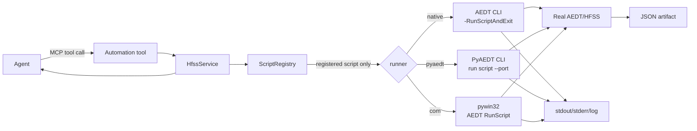

# 模块 7：COM 与 AEDT CLI 适配器

## 版本信息

- 架构版本：v0.1
- 文档日期：2026-07-20
- 状态：核心入口真实验收通过；COM 在 Student 2025 R2 环境中属于无可用 ProgID 的环境限制

## 目标与边界

本模块为 PyAEDT 主路径提供两个受控补充入口：

1. **AEDT CLI runner**：启动 `ansysedt.exe` 或 PyAEDT CLI，执行服务端登记的脚本，并统一收集退出码、标准输出、标准错误、日志和 JSON 产物。
2. **COM adapter**：通过 `pywin32` 连接已经运行的 AEDT 进程，调用 AEDT 的 `RunScript` 执行同一份登记脚本。

MCP 不接受 agent 上传的任意脚本内容、任意脚本路径或任意 shell 命令。agent 只能传递 `script_id`、受控参数和执行模式；脚本由服务器部署并登记。

## 架构



## MCP 接口

### `list_automation_scripts`

返回服务器允许执行的脚本登记表。当前内置：

| script_id | 作用 |
|---|---|
| `aedt_probe` | 读取当前 AEDT 项目和 Design 名称，不修改模型 |

### `run_automation_script`

核心参数如下：

```json
{
  "script_id": "aedt_probe",
  "runner": "pyaedt",
  "operation": "script",
  "port": 50051,
  "arguments": {"request_id": "smoke-001"},
  "relative_output": "scripts/smoke-001.json"
}
```

`runner` 可取 `native`、`pyaedt`、`com`。`batch_solve` 是受控的原生 CLI 操作，要求项目路径位于服务输出根目录内并使用 `.aedt` 文件。

## 三种执行方式

### Native AEDT CLI

服务内部构造参数数组，不经过 shell：

```text
[ansysedt.exe, -RunScriptAndExit, E:\\HFSSagent\\scripts\\aedt_probe.py]
```

因此脚本路径中的特殊字符不会被当作 shell 语法解释。官方 AEDT 命令行文档见：[Ansys AEDT BatchSolve/命令行相关文档](https://ansyshelp.ansys.com/public/Views/Secured/corp/v252/en/opti_ug/opti_apie_aedt_node_support_batch_solve.html)。

### PyAEDT CLI

普通版本服务发现当前 Python 环境中的 `pyaedt.exe`，并使用 IronPython 模式把脚本送入已有 AEDT gRPC 会话。Student 版本使用项目内固定的 PyAEDT bridge，先按端口解析真实 Student AEDT PID，再以 `student_version=True` 和 `aedt_process_id` 附着目标进程，避免官方 CLI 未传递 Student 标志或误启动新进程：

```text
[python.exe, E:\\HFSSagent\\scripts\\pyaedt_student_bridge.py, --port, 50051]
```

普通 `pyaedt run` 只会在独立 Python 子进程执行文件，不能保证进入 HFSS；`--ironpython` 模式才会连接端口并调用 AEDT 的 `RunScript`。当前 Student 版本的官方 CLI 入口没有暴露 Student 标志，因此服务使用固定 bridge 显式连接 Student。官方 CLI 文档见：[PyAEDT CLI](https://aedt.docs.pyansys.com/version/stable/Getting_started/cli.html)。

### COM

服务通过 `win32com.client.GetActiveObject` 获取已运行的 AEDT，再调用其 `RunScript`。服务会依次探测 `HFSS_AGENT_COM_PROGID`、版本化 ProgID 和默认 ProgID。COM 适合服务器与 HFSS 位于同一台 Windows 主机、且已有 AEDT 进程并注册 COM ProgID 的场景；它不承担跨机器网络传输，跨机器仍由 MCP HTTP 或 AEDT gRPC 负责。Student 安装若没有 COM 注册，应使用 native 或 Student bridge 路径。

## 参数与结果契约

脚本执行前，服务临时注入以下环境变量：

- `HFSS_AGENT_SCRIPT_ID`
- `HFSS_AGENT_SCRIPT_ARGS`：JSON 编码的受控参数
- `HFSS_AGENT_SCRIPT_OUTPUT`：受控输出路径

返回结果统一包含：

- `success`
- `command`
- `return_code`
- `stdout`
- `stderr`
- `duration_seconds`
- `log_path`
- `artifact`

## 数据流示例

用户说：“读取当前 HFSS 项目和 Design，并把结果保存为 smoke-001。”

1. Agent 先调用 `list_automation_scripts`，发现 `aedt_probe`。
2. Agent 调用 `run_automation_script`，只提交登记 ID、runner、gRPC 端口和 JSON 参数。
3. MCP 服务校验 ID、脚本路径和输出路径。
4. runner 启动 PyAEDT CLI，或 COM adapter 调用已有 AEDT。
5. `aedt_probe.py` 从真实 AEDT 获取项目和 Design 信息，写入 JSON。
6. MCP 将退出状态、日志路径和 JSON 产物返回给 Agent，Agent 再向用户反馈成功或具体错误。

## 验证要求

离线测试只验证注册表、路径约束、无 shell 调用和结果结构；模块验收必须由专职验证 agent 完成以下真实链路：

`真实 Agent 请求 -> 真实 streamable-http MCP -> 真实 runner -> 真实 HFSS -> JSON 产物 -> Agent 明确确认`

验收截图和报告统一放在 `docs/测试报告`。若真实测试暴露模块级问题，在 `docs/测试问题` 中单独记录并修复后复测。
