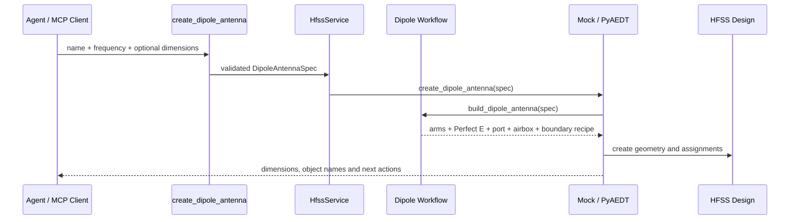

# 天线 Workflow 模块

## 版本信息

- 模块版本：v0.3
- 日期：2026-07-23
- 对应路线：`docs/roadmap.md` 模块 9
- 状态：偶极子 workflow 已通过真实 MCP/HFSS 图形建模与 validation 验收

## 模块目标

在贴片天线 workflow 之外，提供一个结构简单、便于真实 smoke test 的平面中心馈电偶极子。Agent 只提交频率和少量尺寸参数，服务端生成两臂、Perfect E 边界、端口和辐射 airbox 的受控 recipe；MCP tool 不接收或执行任意脚本。

## 核心文件

- `src/hfss_agent_mcp/workflows/dipole.py`：偶极子尺寸估算和几何 recipe。
- `src/hfss_agent_mcp/core/models.py`：`DipoleAntennaSpec` 参数模型。
- `src/hfss_agent_mcp/tools/antenna.py`：`create_dipole_antenna` 工具。
- `src/hfss_agent_mcp/backends/mock.py`：离线状态落地。
- `src/hfss_agent_mcp/backends/pyaedt.py`：真实 Modeler、Perfect E boundary、radiation boundary 和 lumped port 调用。

## 数据流



## 使用示例

自然语言输入：`在当前 HFSS design 中创建一个 2.4 GHz 铜制中心馈电偶极子，臂长自动估算，使用 lumped port。`

Agent 通过 MCP 调用：

```json
{
  "name": "Dipole2G4",
  "frequency_ghz": 2.4,
  "conductor_material": "copper",
  "port_type": "lumped"
}
```

服务端返回对象名、尺寸、Perfect E 边界、辐射边界、端口积分线和后续 setup/solve 工具。真实后端通过 PyAEDT worker 进入指定 AEDT session。

## 已知限制

1. 当前实现平面偶极子和 lumped port；未实现 3D 圆柱导线、wave port 或 balun。
2. airbox 采用简化矩形区域，后续应按工作频率和边界规范细化。
3. 真实 HFSS 中的材料库名称和端口几何仍需以目标 AEDT 版本 smoke test 为准。

## 验证

```powershell
& ".venv\Scripts\python.exe" -B -m unittest tests.test_dipole_workflow tests.test_mock_service -v
```

模块验收还必须由专用 agent 通过真实 streamable HTTP MCP 请求连接 Student HFSS，调用 `create_dipole_antenna`，读取 design summary，并执行 `validate_design`。真实验收中应确认 PyAEDT 日志包含 `Boundary Perfect E ... has been created.`，且 validation 返回 `Design validation check PASSED.`。
