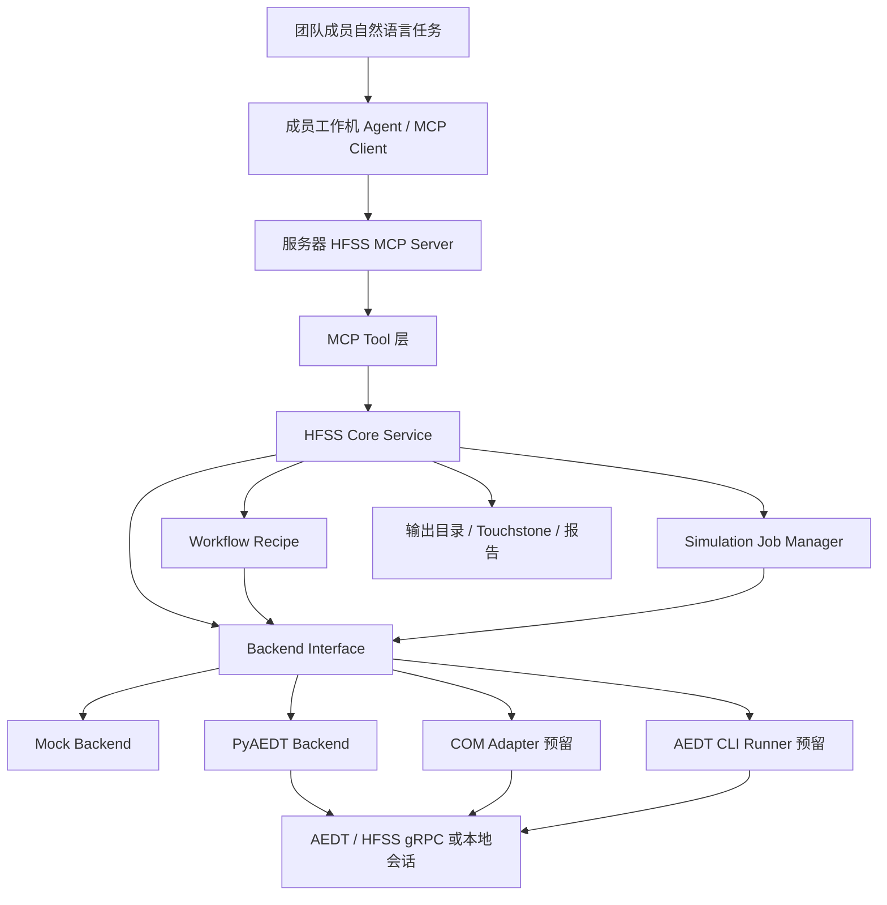
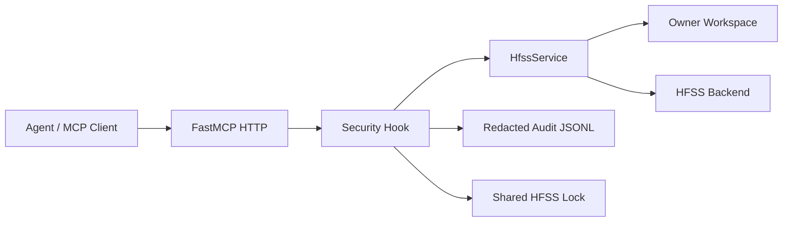

# HFSS MCP 服务架构

## 版本信息

- 架构版本：v0.1
- 日期：2026-07-08
- 状态：骨架、工程/design 管理、贴片天线 workflow、仿真任务管理和 PyAEDT worker 进程隔离已实现；真实 Student 版既有 gRPC 会话连接已通过 smoke test，直接新建 Desktop 的首次 Project/Design 初始化仍需继续增强
- 目标：让团队成员通过各自工作机的 agent 调用服务器端 MCP 服务，完成 HFSS 建模、仿真、验证和结果读取。项目特别面向本地小模型：MCP 服务应把 HFSS 领域知识、标准流程、工具边界和验收规则沉淀为可发现的 resources、prompt/workflow 模板和受控动作积木，使小模型不用临时编写复杂 PyAEDT 脚本，也能通过规划、选择和组合完成设计验证任务。

## 架构图



## 模块说明

`src/hfss_agent_mcp/server.py` 是 MCP 应用入口，负责创建 `FastMCP` 实例并注册工具。该层只处理 MCP 协议集成，不承载 HFSS 业务逻辑。

`src/hfss_agent_mcp/tools/` 是工具暴露层。当前按 `session`、`design`、`antenna`、`simulation`、`results` 拆分，后续可以按团队权限、实验阶段或工具成熟度做分层暴露。

`src/hfss_agent_mcp/core/` 是稳定业务层。`HfssService` 负责参数校验、统一返回结构、输出路径保护、连接尝试状态记录和下一步建议。MCP tool 和后续自建 CLI 都应优先复用这一层。

`src/hfss_agent_mcp/workflows/` 是领域 workflow 层。当前包含贴片天线 recipe 生成逻辑，负责把频率、材料和尺寸参数转换为几何、材料、边界和端口计划。

未来 `resources` 能力应作为小模型的领域工作手册暴露，内容包括常见天线设计流程、工具调用序列、参数选择经验、HFSS validation 规则、典型错误诊断和失败恢复策略。Resources 不直接执行操作，负责降低小模型的领域理解负担；tools 负责执行受控动作；prompts/workflows 负责把多步任务组织成可复用流程。

`src/hfss_agent_mcp/core/jobs.py` 是仿真 job 管理入口。当前提供进程内 job record，用于记录求解任务状态、开始/结束时间、失败原因和日志摘要。

`src/hfss_agent_mcp/backends/` 是闭源软件适配层。当前提供 `mock` 后端用于无 HFSS 环境下跑通工具链，提供 `pyaedt` 后端作为真实 AEDT/HFSS 接入口。PyAEDT 后端已包含 Student 版 executable、`ANSYSEMSV_ROOTxxx`、桌面版本推导、Student gRPC 检测补丁和独立 worker 进程隔离；后续 COM 和官方 CLI 应作为新的 adapter 或 runner 接入，不应反向污染 core。

`tests/` 是离线验证入口。当前测试覆盖 MCP 工具注册、mock 工程/design 管理、贴片 workflow recipe、mock 贴片天线闭环、仿真 job 管理、PyAEDT 连接适配、PyAEDT Student gRPC 检测、PyAEDT worker 进程隔离、PyAEDT 初始化超时保护、Touchstone 输出路径保护。

## 设计原因

第一，MCP server 要作为长期运行的服务器进程，不能把每个 agent 请求都变成临时拼接 Python 代码。当前设计让 agent 调用稳定 tool，tool 调 core，core 调 backend，后续新增能力时只增加新工具或新 backend 方法。

第二，HFSS 是闭源工程软件，真实环境成本高。骨架必须能在没有 HFSS 的机器上跑通，因此保留 mock backend，用它验证工具 schema、数据流、路径安全和 agent 交互流程。

第三，参考 Cai-aa/CAE-Agent-Hub 的经验，后续真实后端应重视显式 session 选择，例如 PID、gRPC port、project path 和 design name，避免服务器上多个 AEDT 实例被误连。当前 `connect_hfss` 已预留 `machine`、`port`、`desktop_version`、`project_path`、`design_name` 等参数。

第四，参考 gfgf2023/hfss-mcp-server 的经验，高层领域工具是提升 agent 效率的关键。当前先暴露 `create_patch_antenna`，但尺寸估算、几何计划、边界和端口不硬写在 MCP tool 中，而是留在 workflow/backend 层，避免后续天线类型扩展时工具层膨胀。

第五，本项目不应把 MCP 设计成 PyAEDT API 的一对一远程包装。对小模型来说，过细的 API 会重新暴露脚本编写难题；过粗的模板又会限制自由设计。长期架构应保持三层能力：领域 resources 提供经验和约束，原子/半原子 tools 提供可组合动作，高层 workflow 提供常见闭环的捷径。所有求解路径都必须经过结构化状态读取、`validate_design` 门禁、结果判据分析和资源释放验证。

## 当前工具

- `health_check`：检查 MCP 服务和后端状态。
- `env_check`：检查 Python、MCP SDK、PyAEDT、AEDT 可执行文件、transport 和输出目录。
- `list_aedt_sessions`：列出 MCP server 已知的 AEDT/HFSS session records。
- `launch_aedt`：创建显式 session record，供后续连接复用。
- `get_session_info`：按 session id 查询会话状态。
- `release_connection`：释放 MCP server 内部 session record。
- `connect_hfss`：连接本地或远程 AEDT/HFSS 会话。
- `connect_hfss` 支持 `connect_timeout_seconds`，后端初始化失败或超时时会返回结构化错误和 failed session record。
- `get_project_info`：读取当前工程状态。
- `create_project`：在受控工程目录下创建 HFSS project。
- `open_project`：从受控工程目录打开 HFSS project。
- `save_project`：保存当前 HFSS project。
- `close_project`：关闭当前 HFSS project。
- `create_hfss_design`：创建或切换 HFSS design。
- `set_active_design`：切换当前 active design。
- `get_design_summary`：读取指定或当前 design 的对象和 setup 摘要。
- `create_model_box`：在当前 design 中创建 3D box 原子几何。
- `create_model_sheet`：在当前 design 中创建矩形 sheet 原子几何。
- `set_object_material`：设置一个已存在对象的材料。
- `assign_perfect_e`：给明确对象名分配 Perfect E 边界。
- `assign_radiation_boundary`：给明确对象名分配 Radiation 边界。
- `create_lumped_port`：在已有 port sheet 上创建 lumped port。
- `delete_model_objects`：删除明确命名的对象，不支持通配符或清空设计。
- `create_patch_antenna`：创建贴片天线 workflow 对象，返回尺寸、几何、材料、边界和端口 recipe。
- `create_dipole_antenna`：创建平面中心馈电偶极子 workflow 对象，返回两臂、端口和 radiation airbox recipe。
- `set_design_variable`：设置一个显式 HFSS design variable。
- `optimize_design_variable`：按有限候选集逐次设置变量、求解并读取 S 参数，返回最佳候选和完整评估记录。
- `create_simulation_setup`：创建 setup、自适应参数和默认扫频。
- `create_frequency_sweep`：为已有 setup 创建或覆盖频率扫频。
- `validate_design`：执行设计验证。
- `run_simulation`：运行指定 setup，并创建可查询 job record。
- `get_simulation_job`：查询仿真 job 状态。
- `get_s_parameters`：读取 S 参数摘要。
- `export_touchstone`：导出 Touchstone 到受控输出目录。

## 运行方式

开发期查看工具：

```powershell
$env:PYTHONPATH="E:\LLMproject\HFSSagent\src"
& "C:\Users\ASUS\.cache\codex-runtimes\codex-primary-runtime\dependencies\python\python.exe" -m hfss_agent_mcp list-tools --backend mock
```

本地 stdio MCP：

```powershell
$env:PYTHONPATH="E:\LLMproject\HFSSagent\src"
& "C:\Users\ASUS\.cache\codex-runtimes\codex-primary-runtime\dependencies\python\python.exe" -m hfss_agent_mcp run --backend mock --transport stdio
```

服务器共享 HTTP MCP：

```powershell
$env:PYTHONPATH="E:\LLMproject\HFSSagent\src"
& "C:\Users\ASUS\.cache\codex-runtimes\codex-primary-runtime\dependencies\python\python.exe" -m hfss_agent_mcp run --backend pyaedt --transport streamable-http --host 0.0.0.0 --port 8000
```

## 参考资料

- MCP 官方介绍：<https://modelcontextprotocol.io/docs/getting-started/intro>
- MCP tools 规范：<https://modelcontextprotocol.io/specification/2025-06-18/server/tools>
- MCP Python SDK：<https://github.com/modelcontextprotocol/python-sdk>
- Cai-aa AEDT MCP：<https://github.com/Cai-aa/CAE-Agent-Hub/tree/main/MCP/Ansys/AEDT%20MCP>
- gfgf2023 HFSS MCP：<https://github.com/gfgf2023/hfss-mcp-server>
- PyAEDT 文档：<https://aedt.docs.pyansys.com/version/stable/>

## 共享部署边界

共享 HTTP 部署在 FastMCP 工具分发前增加请求安全层。该层从请求 metadata 读取 `_meta.client_id`，为请求建立 owner 和 request id，按 owner 选择输出工作区，并将工具调用写入脱敏 JSONL 审计日志；同一服务进程内的 HFSS 操作通过共享锁串行化。业务工具接口保持不变，安全策略集中在 `src/hfss_agent_mcp/core/security.py`。


