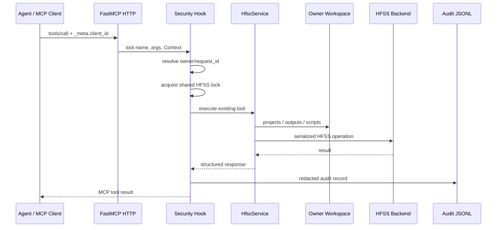

# 模块 8：多用户、安全与服务器部署

## 版本信息

- 架构版本：v0.1
- 文档日期：2026-07-20
- 状态：已通过专职 agent 的真实 MCP HTTP、真实 HFSS、双 client 隔离、审计脱敏和并发锁验收

## 目标

模块 8 为长期运行的共享 MCP server 提供请求级基础设施：

- 用 MCP 请求的 `_meta.client_id` 识别团队成员；
- 按成员隔离项目、脚本产物和导出文件；
- 对所有工具调用记录 JSONL 审计日志，并对 token/password/secret 脱敏；
- 对共享 HFSS backend 的写操作串行化，避免两个 agent 同时切换 Design 或求解；
- 通过配置决定是否强制要求 client ID。

本模块不实现用户目录、OAuth 服务或跨机器 session broker。它提供的是可替换的本地安全边界，后续可接入反向代理认证和数据库审计。

## 架构



## 工作区规则

当请求带有 `client_id=alice` 时，服务使用：

```text
<HFSS_AGENT_OUTPUT_ROOT>/workspaces/alice/projects/
<HFSS_AGENT_OUTPUT_ROOT>/workspaces/alice/scripts/
<HFSS_AGENT_OUTPUT_ROOT>/workspaces/alice/touchstone/
```

`client_id` 只允许安全字符，其他字符会转换为 `_`，最长 80 个字符。直接调用 Python service（不经过 MCP 请求上下文）仍使用原有根目录，保证离线测试和内部调用兼容。

## 审计日志

默认路径：`<HFSS_AGENT_OUTPUT_ROOT>/audit/requests.jsonl`。

每行记录：`timestamp`、`request_id`、`owner`、`client_id`、tool 名、脱敏后的参数、状态和耗时。包含 `token`、`password`、`secret` 或 `authorization` 的字段统一写成 `[REDACTED]`。

## 并发策略

当前一个 MCP server 实例只有一把共享 HFSS 操作锁。请求拿不到锁超过 `HFSS_AGENT_LOCK_TIMEOUT_SECONDS` 后返回结构化错误。这样牺牲部分并发换取 AEDT active project/design 状态的一致性；后续 session broker 可以把锁粒度细化到不同 AEDT 端口。

## 配置

| 环境变量 | 默认值 | 作用 |
|---|---|---|
| `HFSS_AGENT_OUTPUT_ROOT` | `outputs` | 服务根输出目录 |
| `HFSS_AGENT_REQUIRE_CLIENT_ID` | `false` | 是否拒绝没有 `_meta.client_id` 的 MCP 请求 |
| `HFSS_AGENT_AUDIT_LOG` | `<output>/audit/requests.jsonl` | 审计 JSONL 路径 |
| `HFSS_AGENT_LOCK_TIMEOUT_SECONDS` | `30` | 共享 HFSS 锁等待上限 |
| `HFSS_AGENT_MCP_HOST` | `127.0.0.1` | MCP HTTP 监听地址 |
| `HFSS_AGENT_MCP_PORT` | `8000` | MCP HTTP 监听端口 |

团队服务器建议设置：

```powershell
$env:HFSS_AGENT_BACKEND="pyaedt"
$env:HFSS_AGENT_MCP_TRANSPORT="streamable-http"
$env:HFSS_AGENT_MCP_HOST="0.0.0.0"
$env:HFSS_AGENT_MCP_PORT="8000"
$env:HFSS_AGENT_REQUIRE_CLIENT_ID="true"
$env:HFSS_AGENT_OUTPUT_ROOT="E:\HFSSagent-data"
$env:HFSS_AGENT_AUDIT_LOG="E:\HFSSagent-data\audit\requests.jsonl"
$env:HFSS_AGENT_LOCK_TIMEOUT_SECONDS="60"
```

客户端把成员身份放入 MCP 请求元数据，而不是业务参数：

```python
await session.call_tool(
    "create_project",
    {"project_name": "PatchAlice"},
    meta={"client_id": "alice"},
)
```

反向代理、VPN 和防火墙仍必须限制谁可以访问 `http://服务器IP:8000/mcp`；`client_id` 是应用层隔离标识，不是独立的网络认证凭证。

## 部署启动

服务器必须从项目根目录启动，并使用项目虚拟环境：

```powershell
cd E:\HFSSagent
& ".venv\Scripts\python.exe" -m hfss_agent_mcp run `
  --backend pyaedt `
  --transport streamable-http `
  --host 0.0.0.0 `
  --port 8000
```

HTTP endpoint 为 `http://<server-ip>:8000/mcp`。启动前应确认真实 HFSS 已安装、`HFSS_AGENT_AEDT_EXECUTABLE` 已设置、MCP 端口已放行、输出根目录可写。

## 验证方法

离线验证覆盖工作区隔离、审计脱敏、匿名策略和上下文清理。真实验收必须由专职 agent 通过真实 streamable-http MCP 请求完成：使用两个不同 `client_id`，分别调用环境检查、连接真实 HFSS、创建或导出受控产物，检查两个 workspace 和审计记录互不混淆，并确认并发写操作按锁顺序执行。

## 已知限制

1. 当前审计文件是单机 JSONL，不具备集中式日志查询和轮转。
2. 当前一台 server 只有一把 HFSS 锁；不同 AEDT gRPC 端口也会串行。
3. `require_client_id=false` 便于本地开发，但共享服务器不应使用默认值。
4. HTTPS、OAuth、VPN 和 Windows 服务注册应由部署层补充。
