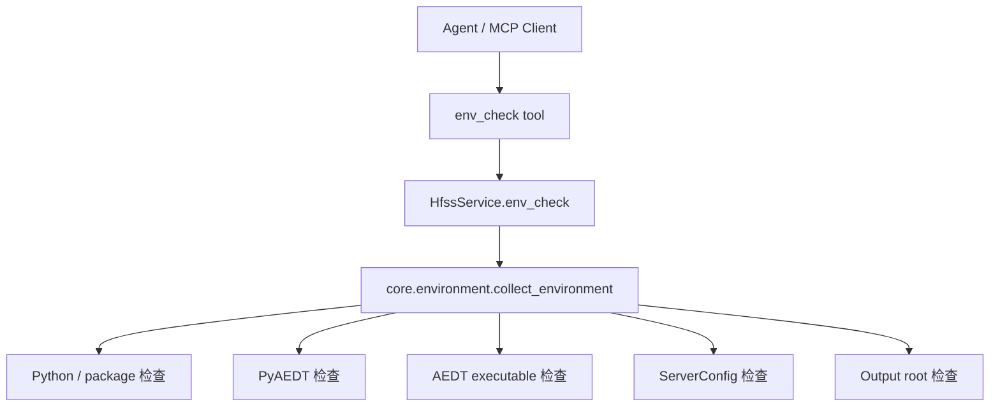

# 环境诊断模块

## 版本信息

- 模块版本：v0.1
- 日期：2026-07-08
- 对应路线：`docs/roadmap.md` 模块 1
- 状态：已实现离线环境诊断和 MCP tool 暴露

## 模块目标

环境诊断模块用于在连接真实 HFSS 之前，快速判断服务器端运行条件是否满足项目要求。它面向两类场景：

1. 开发阶段：确认 Python、MCP SDK、PyAEDT、输出目录和配置项是否正确。
2. 部署阶段：确认服务端是否能找到 AEDT/HFSS 可执行文件，并给出明确缺失项。

该模块只做诊断，不启动 AEDT，不连接 HFSS session，不申请 license。真实连接和会话管理由后续 session 模块负责。

## 架构位置



## 核心文件

- `src/hfss_agent_mcp/core/environment.py`：采集 Python、包、PyAEDT、AEDT、服务配置和输出目录状态。
- `src/hfss_agent_mcp/core/service.py`：提供 `env_check` 业务入口，并在 `health_check` 中返回环境摘要。
- `src/hfss_agent_mcp/tools/session.py`：将 `env_check` 暴露为 MCP tool。
- `src/hfss_agent_mcp/config.py`：新增 `aedt_executable` 配置项。
- `tests/test_environment.py`：覆盖环境诊断、工具注册和配置读取。

## 配置项

| 环境变量 | 含义 | 默认值 |
|---|---|---|
| `HFSS_AGENT_BACKEND` | 后端类型，当前支持 `mock`、`pyaedt` | `mock` |
| `HFSS_AGENT_MCP_TRANSPORT` | MCP transport，支持 `stdio`、`sse`、`streamable-http` | `stdio` |
| `HFSS_AGENT_MCP_HOST` | HTTP/SSE 监听地址 | `127.0.0.1` |
| `HFSS_AGENT_MCP_PORT` | HTTP/SSE 监听端口 | `8000` |
| `HFSS_AGENT_LOG_LEVEL` | 日志级别 | `INFO` |
| `HFSS_AGENT_OUTPUT_ROOT` | 受控输出目录 | `outputs` |
| `HFSS_AGENT_AEDT_EXECUTABLE` | AEDT/HFSS 可执行文件路径 | 空 |

## MCP Tool

### `env_check`

用途：检查服务器运行环境。

返回内容：

- `python`：Python 版本、解释器路径、平台信息。
- `packages`：`mcp`、`pydantic`、`pyaedt` / `ansys-aedt-core` 可用性和版本。
- `aedt`：是否发现 AEDT 可执行文件、路径来源。
- `backend`：配置后端、实际后端、连接状态。
- `server`：MCP 服务名称、transport、host、port、日志级别。
- `output`：输出目录路径、是否存在、是否可写。
- `warnings`：当前缺失项或部署风险。
- `ready`：是否没有诊断 warning。

典型调用顺序：

```text
health_check -> env_check -> connect_hfss
```

## 设计原因

HFSS 自动化强依赖本机软件、license、Python 包和路径配置。如果这些条件不清楚，后续 MCP tool 很容易在真实连接阶段失败，而且失败信息不利于团队成员判断问题。因此环境诊断必须独立成模块，并在 `health_check` 中暴露摘要。

当前实现会在执行 `env_check` 时创建 `HFSS_AGENT_OUTPUT_ROOT`，并用一个临时探针文件验证目录可写。这保证后续导出 Touchstone、CSV 和报告时不会才发现输出目录不可用。

## 已知限制

1. 当前只检查 AEDT 可执行文件是否存在，不检查 license 是否可用。
2. 当前不扫描所有 Ansys 安装目录；推荐通过 `HFSS_AGENT_AEDT_EXECUTABLE` 显式配置。
3. 当前不启动 AEDT，也不连接 gRPC 服务；这些能力属于 session manager 模块。
4. PyAEDT 检查只判断包是否可 import，不验证真实 HFSS API 是否能正常调用。

## 验证方法

运行环境诊断测试：

```powershell
& "C:\Users\ASUS\.cache\codex-runtimes\codex-primary-runtime\dependencies\python\python.exe" -B -m unittest tests.test_environment -v
```

运行全量离线测试：

```powershell
& "C:\Users\ASUS\.cache\codex-runtimes\codex-primary-runtime\dependencies\python\python.exe" -B -m unittest discover -s tests -v
```

确认 MCP 工具已注册：

```powershell
$env:PYTHONPATH="E:\LLMproject\HFSSagent\src"
& "C:\Users\ASUS\.cache\codex-runtimes\codex-primary-runtime\dependencies\python\python.exe" -B -m hfss_agent_mcp list-tools --backend mock
```

预期工具列表包含：

```text
health_check
env_check
connect_hfss
```
