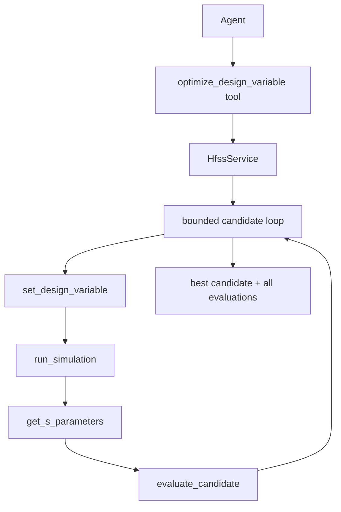

# 优化闭环模块

## 版本信息

- 模块版本：v0.1
- 日期：2026-07-20
- 对应路线：`docs/roadmap.md` 模块 9
- 状态：受限设计变量优化已通过真实 MCP/HFSS 验收

## 目标与边界

`optimize_design_variable` 是一个受控、可审计的候选搜索闭环：Agent 提供一个已有 HFSS design variable 和有限候选值，服务端逐个设置变量、运行指定 setup、读取 S 参数、计算目标函数并返回最佳候选。服务端不接受 Python、PowerShell 或任意优化表达式。

当前目标函数为：

```text
score = |resonance_frequency - target_frequency| + max(0, minimum_s11 - threshold)
```

分数越小越好。候选达到目标频率附近且 `S11 <= threshold_db` 时标记为 `passed`。

## 架构



## MCP 调用示例

```json
{
  "variable_name": "patch_length",
  "candidate_values": ["28mm", "29mm", "30mm"],
  "setup_name": "Setup1",
  "target_frequency_ghz": 2.4,
  "expression": "dB(S(1,1))",
  "threshold_db": -10.0,
  "max_evaluations": 3
}
```

每次评估记录变量值、仿真结果、S 参数分析、score、是否达标和失败原因；达到 `max_evaluations` 或候选耗尽即停止。共享 HTTP 服务中的安全锁会覆盖整个 MCP 工具调用，防止另一个 Agent 在中途切换变量或 Design。

## 核心文件

- `src/hfss_agent_mcp/core/optimization.py`：候选循环和目标函数。
- `src/hfss_agent_mcp/core/service.py`：HFSS 变量设置、求解、结果读取编排。
- `src/hfss_agent_mcp/backends/base.py`：设计变量后端接口。
- `src/hfss_agent_mcp/backends/mock.py`、`pyaedt.py`：变量设置实现。
- `src/hfss_agent_mcp/tools/antenna.py`：MCP 工具入口。

## 安全和限制

1. 候选值由 Agent 显式提交，服务端只按列表执行，并受最大评估次数限制。
2. 当前采用服务端顺序搜索，不调用 AEDT Optimetrics，也不实现遗传算法或任意用户回调。
3. 设计必须已经存在可写的 HFSS design variable 和可求解 setup；变量不存在或 setup 失败时，对应候选记录为失败，全部失败则返回结构化错误。
4. PyAEDT 求解结果必须包含有限的频率和 S 参数值；`NaN`、`Infinity` 或 solver failure 不会进入评分函数。
5. 每个候选都会消耗真实 HFSS 求解时间，Agent 应先用少量候选值验证方向。

## 验证

离线验证：

```powershell
& ".venv\Scripts\python.exe" -B -m unittest tests.test_optimization_loop tests.test_mock_service -v
```

真实验收必须由新的专用 agent 通过真实 MCP HTTP 请求在真实 Student HFSS 中创建全新 design、setup、sweep，调用 `set_design_variable` 和 `optimize_design_variable`，并保存每个候选的返回结果和有限 S 参数点。历史 design/setup 不足以证明新模块通过。
