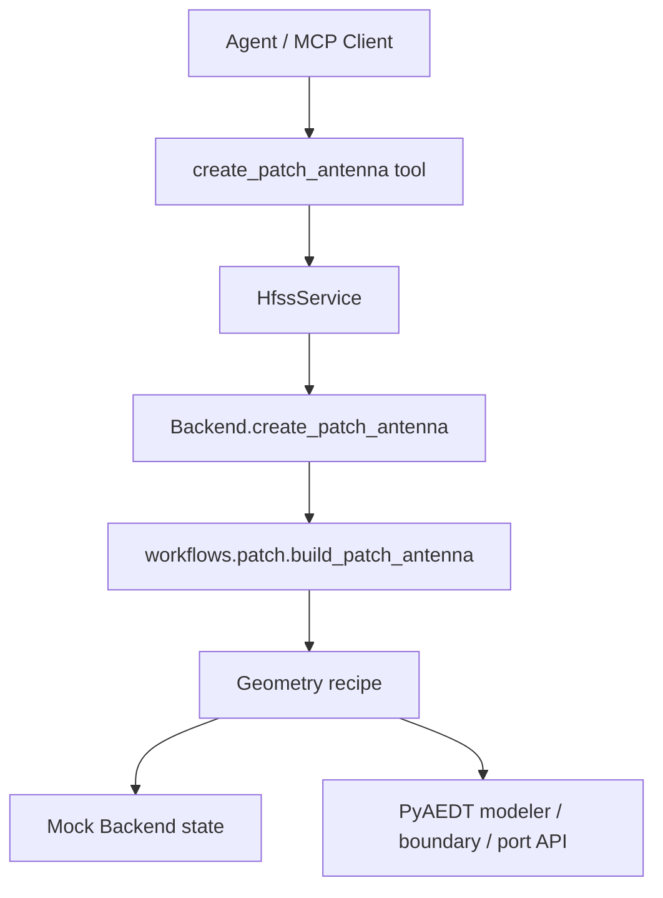
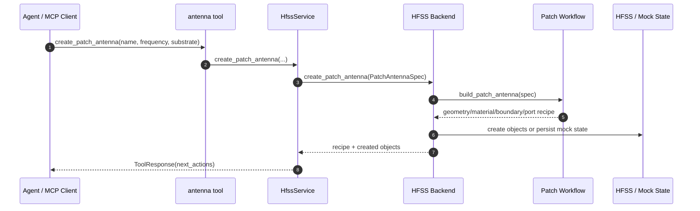

# 贴片天线 Workflow 模块

## 版本信息

- 模块版本：v0.1
- 日期：2026-07-08
- 对应路线：`docs/roadmap.md` 模块 4
- 状态：已实现离线 mock 验证、通用几何 recipe、MCP 工具参数扩展和 PyAEDT 执行入口预留

## 模块目标

贴片天线 Workflow 模块实现第一个面向天线设计的高层领域能力：用户只需给出目标频率、基板材料和少量可选尺寸，agent 调用 `create_patch_antenna` 后，服务端生成 2.4GHz FR4 等微带贴片天线的尺寸、几何对象、材料、辐射边界和端口设置。

该模块的重点不是让 agent 临时写脚本，而是把“贴片天线应该如何建模”的工程规则封装成稳定 workflow。MCP tool 只负责暴露参数入口；workflow 负责生成 recipe；backend 负责把 recipe 落到 mock 状态或真实 PyAEDT/HFSS。

## 架构位置



## 核心文件

- `src/hfss_agent_mcp/workflows/patch.py`：贴片尺寸估算、几何对象计划、材料、边界和端口 recipe。
- `src/hfss_agent_mcp/core/geometry.py`：通用几何、边界和端口数据结构。
- `src/hfss_agent_mcp/core/models.py`：扩展 `PatchAntennaSpec`，包含导体材料、airbox margin 和 port type。
- `src/hfss_agent_mcp/core/service.py`：保留输入校验和统一响应。
- `src/hfss_agent_mcp/tools/antenna.py`：暴露 MCP 工具参数。
- `src/hfss_agent_mcp/backends/mock.py`：将 recipe 写入 active design 状态，供离线验证。
- `src/hfss_agent_mcp/backends/pyaedt.py`：按 recipe 调用 PyAEDT modeler、radiation boundary 和 lumped port 入口。
- `tests/test_patch_workflow.py`：覆盖尺寸计算、recipe 结构、mock 状态落地和手动尺寸覆盖。

## MCP Tool

### `create_patch_antenna`

用途：创建矩形微带贴片天线 workflow 对象。

主要参数：
- `name`：天线名称，用于生成对象名。
- `frequency_ghz`：目标中心频率。
- `substrate_material`：基板材料，默认 `FR4_epoxy`。
- `conductor_material`：导体材料，默认 `copper`。
- `substrate_height_mm`：基板厚度，默认 `1.6`。
- `patch_length_mm` / `patch_width_mm`：可选手动覆盖贴片尺寸。
- `ground_length_mm` / `ground_width_mm`：可选手动覆盖地板尺寸。
- `feed_offset_mm` / `feed_width_mm`：馈线偏移和宽度。
- `airbox_margin_mm`：可选手动覆盖 airbox 外扩距离。
- `port_type`：端口类型，当前稳定路径为 `lumped`。

返回内容：
- `dimensions_mm`：贴片、地板、馈线、airbox 和有效介电常数。
- `object_names`：substrate、ground、patch、feed、airbox、port 对象名。
- `geometry`：5 个基础几何对象的 kind、origin、size、material。
- `boundaries`：radiation boundary 分配。
- `ports`：lumped port 分配和积分线。
- `next_steps`：建议后续工具调用。

## 数据流



## 设计原因

贴片天线是后续所有天线 workflow 的模板。若把公式、对象命名和 HFSS API 调用全部写在 MCP tool 中，后续扩展偶极子、喇叭、阵列或优化闭环时，工具层会迅速膨胀。当前实现把领域知识放入 `workflows.patch`，让 tool 层保持薄层，backend 层只做执行适配。

recipe 结构同时服务三个目标：
1. mock backend 可离线验证尺寸、对象命名和数据流。
2. PyAEDT backend 可按同一 recipe 调用真实 HFSS。
3. agent 可把 recipe 返回给用户，让用户在仿真前确认尺寸和对象。

## 已知限制

1. 当前只实现矩形微带贴片天线，馈电优先使用 lumped port。
2. PyAEDT 入口已实现为通用调用骨架，但真实 HFSS API 签名和建模效果需要在 AEDT 环境中做 smoke test 后微调。
3. 介电常数表目前覆盖 FR4、Rogers4350 和 air；更多材料需要后续扩展材料库。
4. 当前未自动创建 setup/sweep；仿真设置仍由 `create_simulation_setup` 负责。

## 验证方法

运行模块 4 专项测试：

```powershell
& "C:\Users\ASUS\.cache\codex-runtimes\codex-primary-runtime\dependencies\python\python.exe" -B -m unittest tests.test_patch_workflow -v
```

运行全量离线测试：

```powershell
& "C:\Users\ASUS\.cache\codex-runtimes\codex-primary-runtime\dependencies\python\python.exe" -B -m unittest discover -s tests -v
```

确认 MCP 工具注册：

```powershell
$env:PYTHONPATH="E:\LLMproject\HFSSagent\src"
& "C:\Users\ASUS\.cache\codex-runtimes\codex-primary-runtime\dependencies\python\python.exe" -B -m hfss_agent_mcp list-tools --backend mock
```
