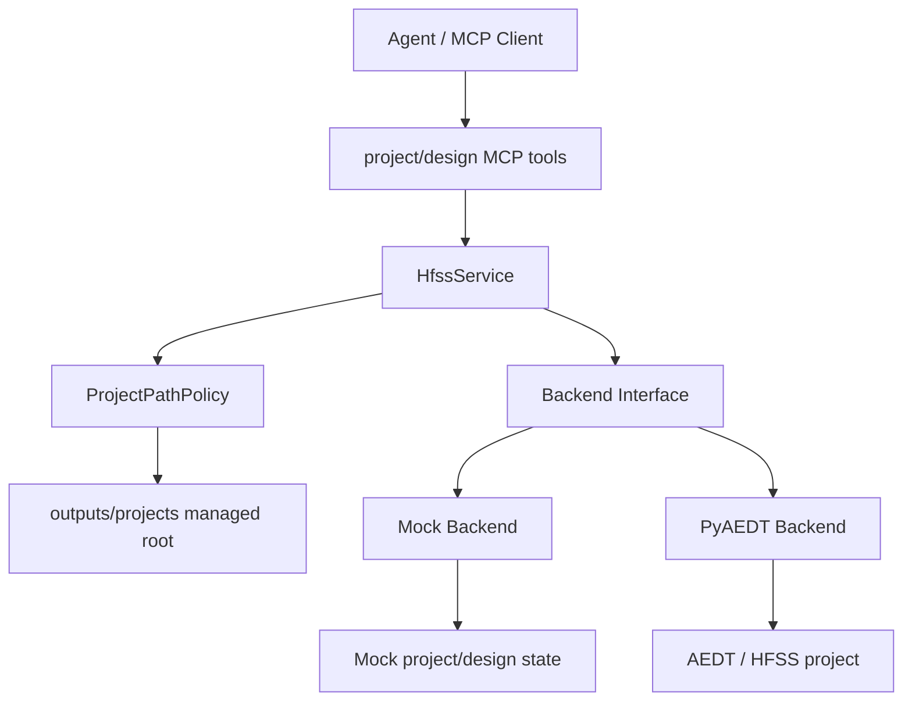
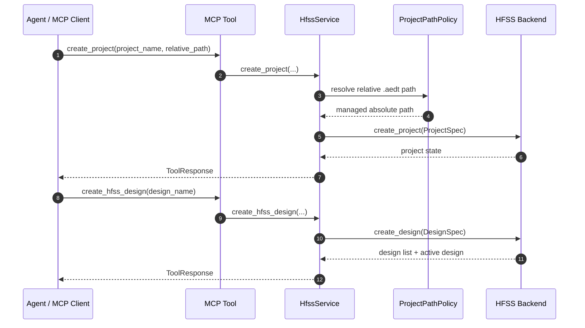

# Project / Design 工程管理模块

## 版本信息

- 模块版本：v0.1
- 日期：2026-07-08
- 对应路线：`docs/roadmap.md` 模块 3
- 状态：已实现离线 mock 验证、MCP 工具暴露和 PyAEDT 后端入口预留

## 模块目标

工程管理模块用于让 agent 在明确的 HFSS 工程上下文中工作：先创建或打开受控工程，再创建、切换和读取 design。它解决的是“自然语言任务到底应该落到哪个 AEDT project、哪个 HFSS design 上”的问题。

该模块不负责天线几何、仿真求解和结果分析。这些能力分别由后续 workflow、simulation 和 results 模块承担。

## 架构位置



## 核心文件

- `src/hfss_agent_mcp/core/project.py`：定义 `ProjectPathPolicy`，将工程文件限制在 `HFSS_AGENT_OUTPUT_ROOT/projects` 下。
- `src/hfss_agent_mcp/core/service.py`：提供工程和 design 的业务入口，负责参数校验、路径解析和统一响应。
- `src/hfss_agent_mcp/backends/base.py`：扩展 backend 协议，新增工程和 design 管理方法。
- `src/hfss_agent_mcp/backends/mock.py`：实现可离线验证的 project/design 状态机。
- `src/hfss_agent_mcp/backends/pyaedt.py`：预留真实 PyAEDT 的 create/open/save/close project 和 design 切换入口。
- `src/hfss_agent_mcp/tools/design.py`：暴露 MCP tools。
- `tests/test_project_service.py`：覆盖模块 3 的离线行为和路径安全约束。

## MCP Tools

### `create_project`

在受控工程目录下创建新 HFSS 工程状态。

参数：
- `project_name`：工程名。
- `relative_path`：可选，相对于 `HFSS_AGENT_OUTPUT_ROOT/projects` 的 `.aedt` 路径；不传时默认使用 `<project_name>.aedt`。

### `open_project`

从受控工程目录打开工程。

参数：
- `relative_path`：相对于 `HFSS_AGENT_OUTPUT_ROOT/projects` 的 `.aedt` 路径。

### `save_project`

保存当前工程。

参数：
- `relative_path`：可选，另存为受控工程目录下的 `.aedt` 路径。

### `close_project`

关闭当前工程，但保留 MCP server 和 session record。

参数：
- `save`：关闭前是否保存。

### `create_hfss_design`

在当前工程中创建或切换 HFSS design。

参数：
- `design_name`
- `project_name`
- `solution_type`

### `set_active_design`

切换当前 active design。若 design 不存在，返回结构化错误。

### `get_design_summary`

读取指定或当前 active design 的对象、setup 和求解摘要。

## 数据流



## 设计原因

工程文件和普通仿真结果文件需要分离管理。普通结果文件使用 `HFSS_AGENT_OUTPUT_ROOT`；HFSS 工程文件统一限制在 `HFSS_AGENT_OUTPUT_ROOT/projects`。这样 agent 只能在受控 workspace 内创建、打开和保存 `.aedt` 文件，不能通过相对路径逃逸到服务器任意目录。

backend 层只接收已经解析好的工程路径，避免每个 backend 重复处理安全规则。未来如果需要按团队成员、项目或 session 隔离工程目录，可以扩展 `ProjectPathPolicy`，而不必改动 MCP tool 的参数入口。

mock backend 现在按 project 保存多 design 状态。每个 design 独立维护 objects、setups 和 solved setups，因此后续贴片天线 workflow、仿真 job 和结果分析可以自然落到 active design 上。

## 已知限制

1. 当前 mock 保存的是轻量 JSON 结构，用于离线验证，不是真实 AEDT 二进制工程。
2. PyAEDT 后端入口已预留，但真实 HFSS smoke test 需要在装有 AEDT/HFSS 的 Windows 服务器上完成。
3. 当前工程目录统一为 `outputs/projects`；按用户或团队项目隔离属于后续部署安全模块。
4. 当前关闭工程只管理 backend 内部状态；真实 PyAEDT 的关闭策略仍需结合团队是否允许 MCP server 管理 AEDT Desktop 生命周期来验证。

## 验证方法

运行模块 3 专项测试：

```powershell
& "C:\Users\ASUS\.cache\codex-runtimes\codex-primary-runtime\dependencies\python\python.exe" -B -m unittest tests.test_project_service -v
```

运行全量离线测试：

```powershell
& "C:\Users\ASUS\.cache\codex-runtimes\codex-primary-runtime\dependencies\python\python.exe" -B -m unittest discover -s tests -v
```

确认 MCP 工具注册：

```powershell
$env:PYTHONPATH="E:\LLMproject\HFSSagent\src"
& "C:\Users\ASUS\.cache\codex-runtimes\codex-primary-runtime\dependencies\python\python.exe" -B -m hfss_agent_mcp list-tools --backend mock
```
