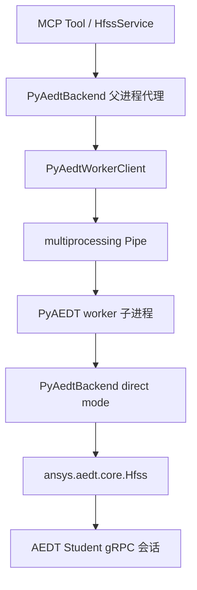

# PyAEDT Backend 模块

## 版本信息

- 模块版本：v0.2
- 日期：2026-07-09
- 对应模块：真实 HFSS 后端适配
- 状态：已接入进程隔离 worker；已验证 MCP 可连接真实 AEDT Student 既有 gRPC 会话

## 模块目标

PyAEDT Backend 负责把 MCP 工具层和业务层的结构化请求转换为 PyAEDT 调用，从而控制 Ansys Electronics Desktop / HFSS。

真实 HFSS 是长会话闭源软件，PyAEDT 初始化可能受 Student 版本、gRPC 端口检测、默认工程/设计创建、许可状态和桌面进程状态影响。因此该模块的边界是：对上提供稳定的 backend 接口；对下隔离 PyAEDT/AEDT 的阻塞风险，并尽量保留明确错误。

## 架构



## 核心设计

父进程中的 `PyAedtBackend` 默认不直接创建 `Hfss(...)` 对象，而是通过 `_PyAedtWorkerClient` 把命令发送给独立 worker 子进程。worker 子进程内使用 `PyAedtBackend(use_process_worker=False)`，让真正的 PyAEDT 调用运行在该子进程主线程。

采用进程隔离有两个原因：

1. FastMCP 可能在线程中执行同步 tool；PyAEDT Student 初始化在非主线程中容易卡在默认 design 创建阶段。
2. 线程超时不能可靠中断底层 PyAEDT/AEDT 调用；进程隔离允许父进程在超时后终止 worker，并返回结构化 `SessionError`。

## Student gRPC 检测补丁

PyAEDT 1.2.0 在 Windows Student 版场景下，启动 AEDT 后会等待 `is_grpc_session_active(port)` 返回 true。但该检测默认不包含 `ansysedtsv.exe` Student 进程，导致 AEDT 端口已经监听时，PyAEDT 仍持续等待。

本模块在 Student 连接初始化期间临时替换 PyAEDT desktop 模块中的检测函数，让它补充查询：

```python
active_sessions(student_version=True, non_graphical=None)
```

该补丁只在 `Hfss(...)` 初始化上下文中生效，退出后恢复原函数。

## 当前命令覆盖

worker 已覆盖以下 backend 命令：

- `connect`
- `get_project_info`
- `create_project`
- `open_project`
- `save_project`
- `close_project`
- `create_design`
- `set_active_design`
- `get_design_summary`
- `create_patch_antenna`
- `create_setup`
- `create_frequency_sweep`
- `validate_design`
- `run_simulation`
- `get_s_parameters`
- `export_touchstone`

## 已知限制

1. 当前一个 `PyAedtBackend` 实例只维护一个 worker 和一个 active PyAEDT 会话，不等价于多用户多会话 broker。
2. `connect_hfss(new_desktop=true)` 在真实 Student 2025 R2 环境中仍可能卡在首次 Project/Design 初始化；现在该卡点会被 worker 超时保护捕获，不再拖死 MCP 服务。
3. 已验证 `connect_hfss(port=既有gRPC端口)` 可以通过 MCP 连接真实 AEDT Student 会话，并可继续调用 `get_project_info`。
4. 后续应把 `launch_aedt` 从“只创建 session record”升级为“启动或扫描真实 AEDT gRPC 端口”，并让 agent 优先走“显式端口绑定”。

## 验证方法

离线专项测试：

```powershell
& "C:\Users\ASUS\.cache\codex-runtimes\codex-primary-runtime\dependencies\python\python.exe" -B -m unittest tests.test_pyaedt_backend tests.test_connection_timeout -v
```

真实 MCP smoke test：

```powershell
$env:PYTHONPATH="E:\LLMproject\HFSSagent\src"
$env:HFSS_AGENT_AEDT_EXECUTABLE="D:\Ansys\ANSYS Inc\ANSYS Student\v252\AnsysEM\ansysedtsv.exe"
& "C:\Users\ASUS\.cache\codex-runtimes\codex-primary-runtime\dependencies\python\python.exe" -B -m hfss_agent_mcp run --backend pyaedt --transport streamable-http --host 127.0.0.1 --port 8022
```

MCP client 调用已验证：

- `connect_hfss(student_version=true, desktop_version="2025.2", machine="localhost", port=55469, connect_timeout_seconds=30)` 返回 `status="ok"`。
- `get_project_info()` 返回真实工程 `Project1` 和 design `HFSS_FIF`。
