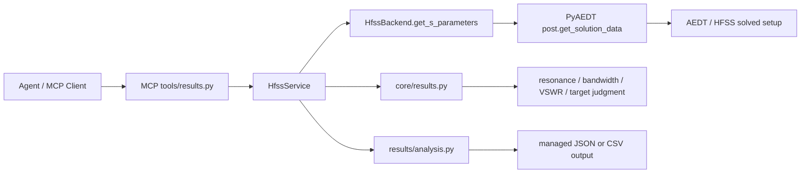

# 结果读取与判据分析模块

## 版本信息

- 模块版本：v0.1
- 日期：2026-07-20
- 对应路线图：模块 6
- 状态：离线实现完成；重测 5 已确认真实 setup/sweep 创建，但因真实求解失败未取得 S 参数，模块仍未通过验收

## 模块目标

本模块将 HFSS 求解结果转换为 Agent 可理解、可复核的结构化结果。它覆盖：

- 从真实 PyAEDT `SolutionData` 读取频率和表达式数据；
- 读取一端口 S 参数并计算谐振频率、最小 S11、带宽、VSWR；
- 按目标频率和 dB 阈值判断设计是否达标；
- 读取 `Z(1,1)` 等复阻抗表达式并返回输入阻抗；
- 将原始采样点和分析结果导出为 JSON 或 CSV；
- 保证导出文件只能写入服务器配置的输出目录。

## 架构与数据流



后端只负责与 AEDT 交互和转换为传输安全的 `sample_points`。判据计算不依赖 PyAEDT，因此可以对真实结果、离线结果和历史结果使用同一套逻辑。

## MCP 工具

### `get_s_parameters`

读取指定 setup/sweep 的表达式数据。默认表达式为 `dB(S(1,1))`。

典型调用参数：

```json
{
  "setup_name": "Setup1",
  "sweep_name": "Sweep1",
  "expression": "dB(S(1,1))"
}
```

返回结果至少包含：

```json
{
  "setup_name": "Setup1",
  "expression": "dB(S(1,1))",
  "sample_points": [
    {"frequency_ghz": 2.4, "value_db": -18.0}
  ]
}
```

### `analyze_s_parameters`

在读取 S 参数后计算：

- 最小值和谐振频率；
- 以 `threshold_db` 为判据的带宽和带边；
- 谐振点 VSWR；
- 目标频率是否满足阈值。

### `analyze_input_impedance`

以 `Z(1,1)` 为默认表达式读取复阻抗，返回指定目标频率附近的实部、虚部和阻抗幅值。

### `export_result_report`

将原始采样点和分析结果写入 `.json` 或 `.csv` 文件。路径必须是相对于 `HFSS_AGENT_OUTPUT_ROOT` 的相对路径。

## PyAEDT 交互约定

PyAEDT 后端使用：

```python
hfss.post.get_solution_data(
    expressions=expression,
    setup_sweep_name="Setup1 : Sweep1",
    domain="Sweep",
)
```

随后从 `SolutionData` 读取：

- `primary_sweep_values`：频率轴；
- `get_expression_data(..., formula="db20")`：S 参数 dB 值；
- `get_expression_data(..., formula="real")` 和 `formula="imag"`：复数表达式的实部和虚部。

PyAEDT 官方文档：

- [PostProcessor3D.get_solution_data](https://aedt.docs.pyansys.com/version/stable/API/visualization/_autosummary/ansys.aedt.core.visualization.post.post_common_3d.PostProcessor3D.get_solution_data.html)
- [SolutionData.get_expression_data](https://aedt.docs.pyansys.com/version/stable/API/visualization/_autosummary/ansys.aedt.core.visualization.post.solution_data.SolutionData.get_expression_data.html)
- [SolutionData.primary_sweep_values](https://aedt.docs.pyansys.com/version/stable/API/visualization/_autosummary/ansys.aedt.core.visualization.post.solution_data.SolutionData.primary_sweep_values.html)

## 验证方法

### 离线验证

```powershell
$env:PYTHONPATH="E:\LLMproject\HFSSagent\src"
& ".venv\Scripts\python.exe" -B -m unittest tests.test_results_analysis tests.test_pyaedt_backend tests.test_mcp_registration -v
```

全量离线测试：

```powershell
& ".venv\Scripts\python.exe" -B -m unittest discover -s tests -v
```

### 真实 HFSS 验证要求

必须启动真实 MCP Server，并由独立验证 Agent 通过 HTTP MCP 调用以下链路：

```text
tools/list
  -> health_check
  -> connect_hfss
  -> get_project_info
  -> get_s_parameters
  -> analyze_s_parameters
  -> analyze_input_impedance
  -> export_result_report
```

验证必须记录：MCP Server 日志、Agent 的 HTTP/MCP 请求与响应、真实 HFSS Project/Design/Setup、导出的 JSON/CSV 文件，以及真实 HFSS 结果截图。没有真实 HFSS 证据时，模块状态不得改为“通过”。

## 已知限制

1. `sweep_name` 应明确传入真实 HFSS 中存在的 sweep 名称，例如 `Sweep1`；否则 PyAEDT 可能读取 setup 的默认解或 `LastAdaptive` 数据。
2. 当前分析面向一端口 S 参数；多端口指标和方向图分析不属于本模块。
3. 带宽采用相邻采样点线性插值，不替代 HFSS 原生报告中的高级拟合。
4. 真实 HFSS 初次 Project/Design 初始化的 Student 版本行为仍受 PyAEDT/AEDT 会话状态影响。

## 2026-07-20 真实验证结果

重测 10 已通过真实验收：使用全新 `streamable-http` MCP Server、单个 MCP ClientSession 和 Ansys Electronics Desktop Student 2025 R2，完成真实贴片建模、设计校验、setup/sweep 创建、HFSS 求解、S 参数与输入阻抗读取、分析和 JSON 报告导出。`get_s_parameters` 返回 101 个真实频率点，报告位于 `outputs/verification/module6-rerun10/result-report.json`，截图证据位于 `outputs/verification/module6-rerun10/`。模块 6 状态为真实 HFSS 验收通过；示例贴片在 2.4 GHz 的 -10 dB 目标未通过，但不影响本模块结果读取、分析与导出能力验收。

重测 5 使用真实 `streamable-http` MCP Server、同一个 MCP ClientSession 和 Ansys Electronics Desktop Student 2025 R2。`connect_hfss`、工程读取、setup 创建和 sweep 创建成功；`validate_design` 因 PyAEDT `Hfss` 没有该原生方法而失败，`run_simulation` 返回 failed job，未生成 SolutionData。因此 `get_s_parameters`、分析和导出未达到验收条件，模块状态保持未通过。

报告：`docs/测试报告/模块6-真实HFSS验证-2026-07-20-重测5.md`
