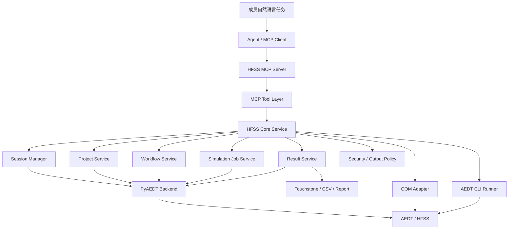

# HFSS MCP 服务实现路线

> **For agentic workers:** REQUIRED SUB-SKILL: Use superpowers:subagent-driven-development (recommended) or superpowers:executing-plans to implement this plan task-by-task. Steps use checkbox (`- [ ]`) syntax for tracking.

**Goal:** 将当前 v0.1 MCP 骨架逐步建设为可由团队成员 agent 远程调用的 HFSS 建模、仿真、验证服务。

**Architecture:** MCP tool 层保持轻量，只负责工具暴露和参数入口；HFSS Core 负责业务编排、校验、错误返回和输出约束；Backend 层隔离 PyAEDT、COM 和 AEDT CLI 等闭源软件控制方式。每个大模块独立实现、独立验证、独立提交。

**Tech Stack:** Python 3.10+、MCP Python SDK/FastMCP、PyAEDT、Ansys AEDT/HFSS 2022 R2+、unittest、后续可选 pywin32 和官方 AEDT CLI。

---

## 版本信息

- 文档版本：v0.1
- 日期：2026-07-08
- 当前代码状态：已完成 MCP 服务骨架、mock backend、PyAEDT backend 接口预留、基础工具注册、工程/design 管理、贴片天线 workflow 和仿真任务管理离线测试。
- 当前主线：先打通服务器端 MCP 到 HFSS 的稳定控制底座，再实现贴片天线最小闭环，最后扩展多用户、结果分析和更多天线 workflow。

## 总体原则

1. **先稳定底座，再扩展领域能力**：先做好环境诊断、session 管理、工程管理，再做复杂天线模板和优化流程。
2. **MCP tool 保持薄层**：tool 只暴露 name、description、参数入口，不直接写 HFSS 操作细节。
3. **Core 作为共享业务层**：MCP tool、未来自建 CLI、测试脚本都调用同一个 Core，避免重复实现。
4. **Backend 隔离闭源软件差异**：PyAEDT 是主路径，COM 是补充路径，AEDT CLI 是批处理和兜底路径。
5. **每个大模块必须可验证**：没有 HFSS 时要有 mock 测试；有 HFSS 时要有 smoke test。
6. **每个大模块单独 commit**：commit 信息简单直接，例如 `add env checks`、`add session manager`。

## 目标架构



## 模块路线

### 模块 1：环境诊断与运行配置

**目标**

让服务端能明确告诉团队：当前 Python、MCP SDK、PyAEDT、AEDT/HFSS、license、输出目录和 transport 配置是否满足运行要求。

**功能范围**

- 增强 `health_check`，返回 Python 版本、MCP 包版本、后端类型、输出目录、transport 建议。
- 新增 `env_check` tool，检查 PyAEDT import、AEDT 安装路径、可选 `ansysedt.exe` 路径、环境变量。
- 配置项统一放入 `ServerConfig`，支持环境变量和 CLI 参数覆盖。
- 文档补充服务器部署前置条件。

**主要文件**

- 修改：`src/hfss_agent_mcp/config.py`
- 修改：`src/hfss_agent_mcp/tools/session.py`
- 修改：`src/hfss_agent_mcp/core/service.py`
- 新增：`src/hfss_agent_mcp/core/environment.py`
- 测试：`tests/test_environment.py`
- 文档：`docs/environment.md`

**验证方法**

- `python -B -m unittest discover -s tests -v`
- `python -B -m hfss_agent_mcp list-tools --backend mock`
- 调用 `env_check`，在无 HFSS 环境下应返回结构化缺失项，而不是抛异常。

**提交点**

- `add env checks`

### 模块 2：Session Manager

**目标**

建立稳定的 AEDT/HFSS 会话管理，避免服务器上多个 AEDT 实例、多个工程或多个团队成员之间误连。

**功能范围**

- 新增 session 数据模型：session id、backend、machine、port、project path、design name、owner、状态、创建时间。
- 新增 `list_aedt_sessions`、`launch_aedt`、`connect_hfss`、`release_connection`、`get_session_info`。
- 明确连接策略：默认不自动选择未知 AEDT 实例；真实后端优先使用显式 `machine + port` 或明确 project/design。
- mock backend 支持多 session 状态模拟。
- PyAEDT backend 支持持有当前 session，并为后续多 session broker 预留接口。

**主要文件**

- 新增：`src/hfss_agent_mcp/core/session.py`
- 修改：`src/hfss_agent_mcp/core/models.py`
- 修改：`src/hfss_agent_mcp/backends/base.py`
- 修改：`src/hfss_agent_mcp/backends/mock.py`
- 修改：`src/hfss_agent_mcp/backends/pyaedt.py`
- 修改：`src/hfss_agent_mcp/tools/session.py`
- 测试：`tests/test_session_manager.py`
- 文档：`docs/session.md`

**验证方法**

- mock 测试覆盖创建、连接、释放、重复连接、未知 session id。
- PyAEDT 环境 smoke test：连接已启动的 AEDT gRPC 服务，例如 `-grpcsrv 50051`。
- 确认错误返回包含 `error_type`、message 和 next_actions。

**提交点**

- `add session manager`

### 模块 3：Project / Design 工程管理

**目标**

让 agent 能可靠创建、打开、保存工程，并创建或切换 HFSS design。

**功能范围**

- 工程操作：new project、open project、save project、close project。
- Design 操作：create HFSS design、set active design、read design summary。
- 基础状态读取：project name、project path、design list、active design、solution type、object count。
- 输出路径与工程路径分离，禁止 agent 任意写服务器路径。

**主要文件**

- 新增：`src/hfss_agent_mcp/core/project.py`
- 修改：`src/hfss_agent_mcp/tools/design.py`
- 修改：`src/hfss_agent_mcp/backends/base.py`
- 修改：`src/hfss_agent_mcp/backends/mock.py`
- 修改：`src/hfss_agent_mcp/backends/pyaedt.py`
- 测试：`tests/test_project_service.py`
- 文档：`docs/project.md`

**验证方法**

- mock 测试覆盖新建、保存、切换 design。
- 真实 HFSS smoke test：创建空 `.aedt` 工程，插入 HFSS DrivenModal design，保存到受控工作目录。
- 验证非法路径无法逃逸输出根目录。

**提交点**

- `add project tools`

### 模块 4：贴片天线 Workflow

**目标**

实现第一个完整领域 workflow：2.4GHz FR4 微带贴片天线建模。

**功能范围**

- 贴片尺寸估算：频率、介电常数、基板厚度、贴片长宽、地板尺寸、馈线尺寸。
- 几何创建：substrate、ground、patch、feed、airbox。
- 材料设置：FR4、PEC/铜、空气。
- 边界设置：radiation boundary。
- 端口设置：优先实现 wave port 或 lumped port 中最稳妥的一种，再扩展另一种。
- 返回对象名称、尺寸、建议下一步。

**主要文件**

- 新增：`src/hfss_agent_mcp/workflows/patch.py`
- 新增：`src/hfss_agent_mcp/core/geometry.py`
- 修改：`src/hfss_agent_mcp/tools/antenna.py`
- 修改：`src/hfss_agent_mcp/backends/base.py`
- 修改：`src/hfss_agent_mcp/backends/mock.py`
- 修改：`src/hfss_agent_mcp/backends/pyaedt.py`
- 测试：`tests/test_patch_workflow.py`
- 文档：`docs/patch.md`

**验证方法**

- mock 测试验证尺寸计算、对象命名、返回结构。
- 真实 HFSS smoke test 验证对象在 Modeler 中存在，材料和边界创建成功。
- 手工打开 HFSS 检查几何位置、尺寸、端口位置是否合理。

**提交点**

- `add patch workflow`

### 模块 5：仿真设置与任务管理

**目标**

让 agent 能创建 setup/sweep、验证设计、启动求解，并在长时间仿真过程中查询状态。

**功能范围**

- `create_simulation_setup` 增强：setup 名称、中心频率、自适应设置。
- `create_frequency_sweep` 独立化：起止频率、点数、扫频类型。
- `validate_design` 返回结构化 warning/error。
- `run_simulation` 支持同步小任务和异步 job。
- 新增 job id、状态、开始时间、结束时间、日志摘要、失败原因。

**主要文件**

- 新增：`src/hfss_agent_mcp/core/jobs.py`
- 新增：`src/hfss_agent_mcp/core/simulation.py`
- 修改：`src/hfss_agent_mcp/tools/simulation.py`
- 修改：`src/hfss_agent_mcp/backends/base.py`
- 修改：`src/hfss_agent_mcp/backends/mock.py`
- 修改：`src/hfss_agent_mcp/backends/pyaedt.py`
- 测试：`tests/test_simulation_jobs.py`
- 文档：`docs/simulation.md`

**验证方法**

- mock 测试覆盖 job 创建、状态轮询、失败状态、未知 job id。
- 真实 HFSS smoke test 跑轻量 patch setup。
- 验证运行中状态不会阻塞 MCP server 后续请求。

**提交点**

- `add simulation jobs`

### 模块 6：结果读取与判据分析

**目标**

让 agent 不只导出文件，还能读取关键结果并用工程判据给用户反馈。

**功能范围**

- S 参数读取：`S(1,1)`、`S(2,1)`，支持 dB 和复数数据。
- 指标分析：最小 S11、谐振频率、-10dB 带宽、VSWR、输入阻抗。
- 文件导出：Touchstone、CSV、报告数据。
- 目标判断：例如“2.4GHz 附近 S11 < -10dB 是否满足”。

**主要文件**

- 新增：`src/hfss_agent_mcp/core/results.py`
- 新增：`src/hfss_agent_mcp/results/analysis.py`
- 修改：`src/hfss_agent_mcp/tools/results.py`
- 修改：`src/hfss_agent_mcp/backends/base.py`
- 修改：`src/hfss_agent_mcp/backends/mock.py`
- 修改：`src/hfss_agent_mcp/backends/pyaedt.py`
- 测试：`tests/test_results_analysis.py`
- 文档：`docs/results.md`

**验证方法**

- mock 测试使用固定 S11 数据验证谐振点和带宽计算。
- 真实 HFSS smoke test 读取求解后的 S 参数。
- 导出的 Touchstone/CSV 必须位于受控输出目录。

**提交点**

- `add result analysis`

### 模块 7：COM Adapter 与 AEDT CLI Runner

**目标**

补齐 PyAEDT 不覆盖或不稳定的能力，并提供批处理、长任务和兜底执行路径。

**功能范围**

- COM adapter：封装 pywin32 / AEDT native script 的最小调用接口。
- CLI runner：封装 `ansysedt.exe -RunScriptAndExit`、`BatchSolve`、`BatchExtract`。
- 统一返回 stdout、stderr、exit code、日志路径。
- 严禁执行 agent 临时生成的任意代码；只允许运行受控模板或项目内脚本。

**主要文件**

- 新增：`src/hfss_agent_mcp/backends/com.py`
- 新增：`src/hfss_agent_mcp/backends/cli_runner.py`
- 新增：`src/hfss_agent_mcp/core/scripts.py`
- 修改：`src/hfss_agent_mcp/backends/factory.py`
- 测试：`tests/test_cli_runner.py`
- 文档：`docs/adapters.md`

**验证方法**

- mock/subprocess 测试验证命令拼接不经过 shell 注入。
- 无 AEDT 环境下返回可解释的缺失错误。
- 有 AEDT 环境下用固定脚本跑一次 `RunScriptAndExit` smoke test。

**提交点**

- `add hfss adapters`

### 模块 8：多用户、安全与服务器部署

**目标**

让服务可以作为团队共享 MCP server 使用，控制路径、会话、日志和权限风险。

**功能范围**

- 用户/请求标识：owner、request id、session id。
- 输出隔离：按用户或项目生成 output workspace。
- 操作审计：记录 tool name、参数摘要、session、结果状态、耗时。
- 并发控制：同一 HFSS session 上的写操作串行化。
- 部署配置：HTTP transport、host/port、日志级别、输出根目录。

**主要文件**

- 新增：`src/hfss_agent_mcp/core/security.py`
- 新增：`src/hfss_agent_mcp/core/audit.py`
- 新增：`src/hfss_agent_mcp/core/locks.py`
- 修改：`src/hfss_agent_mcp/server.py`
- 修改：`src/hfss_agent_mcp/config.py`
- 测试：`tests/test_security.py`
- 文档：`docs/deployment.md`

**验证方法**

- mock 测试验证路径隔离、并发锁、审计记录。
- 启动 streamable-http MCP server，确认 agent client 可连接。
- 两个模拟用户使用不同 output workspace，不互相覆盖。

**提交点**

- `add server deployment controls`

### 模块 9：更多天线与优化闭环

**目标**

在贴片天线闭环稳定后，扩展更多常见天线和自动调参能力。

**功能范围**

- 偶极子、喇叭、阵列、Vivaldi、螺旋天线等 workflow。
- 参数扫描：贴片长宽、馈点、基板厚度、阵列间距。
- 优化目标：目标频点 S11、带宽、增益、方向图。
- Agent 反馈闭环：仿真不满足目标时返回建议参数调整。

**主要文件**

- 新增：`src/hfss_agent_mcp/workflows/`
- 新增：`src/hfss_agent_mcp/optimization/`
- 修改：`src/hfss_agent_mcp/tools/antenna.py`
- 修改：`src/hfss_agent_mcp/tools/results.py`
- 测试：`tests/test_workflows.py`
- 文档：按模块新增，例如 `docs/antenna-workflows.md`、`docs/optimization.md`

**验证方法**

- 每个新 workflow 必须先有 mock 单元测试。
- 每类天线保留一个真实 HFSS smoke test 工程。
- 优化闭环必须记录每次参数、结果和停止原因。

**提交点**

- `add antenna workflows`
- `add optimization loop`

## 近期执行顺序

- [x] 模块 1：环境诊断与运行配置。
- [x] 模块 2：Session Manager。
- [x] 模块 3：Project / Design 工程管理。
- [x] 模块 4：贴片天线 Workflow。
- [x] 模块 5：仿真设置与任务管理。
- [ ] 模块 6：结果读取与判据分析。
- [ ] 模块 7：COM Adapter 与 AEDT CLI Runner。
- [ ] 模块 8：多用户、安全与服务器部署。
- [ ] 模块 9：更多天线与优化闭环。

## 每个模块的完成标准

1. 代码实现完成，并保持 MCP tool 层、Core 层、Backend 层边界清晰。
2. 至少有 mock/offline 测试；涉及真实 HFSS 的模块要补 smoke test 说明。
3. 文档放入 `docs`，文件名简洁，一个模块一个文档。
4. 运行验证命令并确认通过。
5. 做一次简单直接的 git commit。

## 标准验证命令

离线基础验证：

```powershell
& "C:\Users\ASUS\.cache\codex-runtimes\codex-primary-runtime\dependencies\python\python.exe" -B -m unittest discover -s tests -v
```

MCP 工具注册验证：

```powershell
$env:PYTHONPATH="E:\LLMproject\HFSSagent\src"
& "C:\Users\ASUS\.cache\codex-runtimes\codex-primary-runtime\dependencies\python\python.exe" -B -m hfss_agent_mcp list-tools --backend mock
```

服务器 MCP 启动验证：

```powershell
$env:PYTHONPATH="E:\LLMproject\HFSSagent\src"
& "C:\Users\ASUS\.cache\codex-runtimes\codex-primary-runtime\dependencies\python\python.exe" -B -m hfss_agent_mcp run --backend mock --transport streamable-http --host 127.0.0.1 --port 8000
```

真实 HFSS gRPC 预期启动方式：

```powershell
& "C:\Program Files\AnsysEM\v252\Win64\ansysedt.exe" -grpcsrv 50051
```

## 风险与控制

| 风险 | 控制方式 |
|---|---|
| 误连错误 AEDT 实例 | 使用显式 session id、PID、machine、port、project path |
| 大模型生成任意脚本带来安全风险 | MCP 只暴露受控工具；CLI runner 只运行项目内受控脚本 |
| 没有 HFSS 环境导致无法开发 | mock backend 覆盖 schema、流程和错误处理 |
| 真实仿真耗时长 | 引入 job id、状态轮询、超时和日志摘要 |
| 多成员共享服务器互相覆盖输出 | 输出目录按用户/project/session 隔离 |
| PyAEDT 覆盖不足 | COM adapter 和 AEDT CLI runner 作为补充 |

## 决策点

后续开始实现前，建议先确认以下实际部署条件：

1. 服务器操作系统是 Windows 还是 Linux。
2. AEDT/HFSS 版本，建议 2022 R2 及以上，优先 2024 R2 或更新。
3. 团队成员的 agent 是否支持 streamable-http MCP client。
4. 是否允许 MCP server 直接启动 AEDT，还是只能连接管理员预启动的 AEDT gRPC 服务。
5. 输出文件按用户隔离还是按项目隔离。
