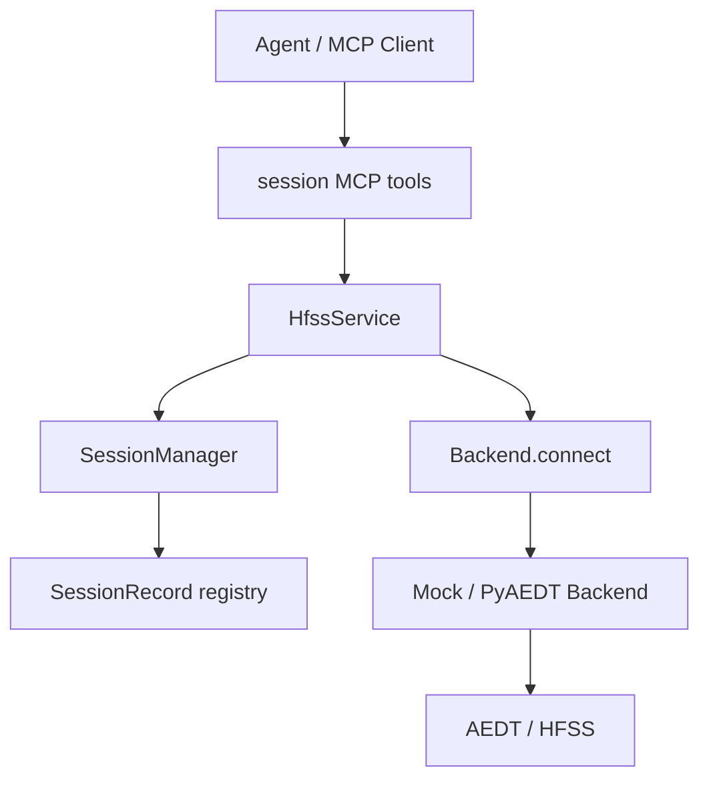
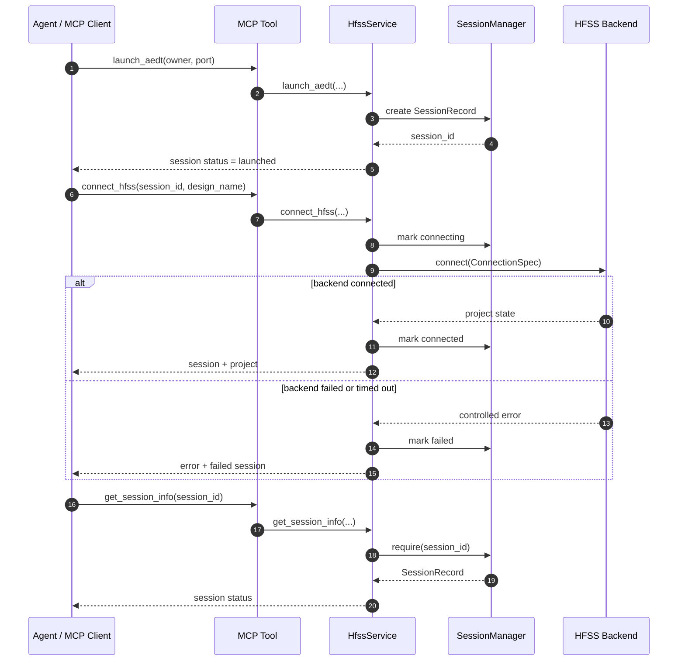

# Session Manager 模块

## 版本信息

- 模块版本：v0.1
- 日期：2026-07-08
- 对应路线：`docs/roadmap.md` 模块 2
- 状态：已实现 MCP server 内部 session record 管理、连接中/失败状态记录、PyAEDT worker 进程超时保护、mock 验证和工具暴露

## 模块目标

Session Manager 用于在 MCP server 内部显式管理 AEDT/HFSS 会话记录，避免团队服务器上出现多个 AEDT 实例、多个工程或多个成员请求时误连错误会话。

该模块当前解决的是“显式会话记录与绑定”问题：所有连接 HFSS 的动作都会产生或复用一个 `session_id`，后续工具可以围绕这个 session 继续工作。连接真实后端时，session 会先进入 `connecting` 状态；如果后端初始化失败或超时，则保留为 `failed` 状态并记录失败原因，避免一次 PyAEDT 初始化卡住后 agent 无法追踪问题。真实 PyAEDT 调用已迁移到独立 worker 子进程，MCP server 父进程负责超时和错误记录。真实 AEDT 进程扫描、真实进程启动和多 session broker 会在后续迭代中增强。

## 架构位置



## 核心文件

- `src/hfss_agent_mcp/core/session.py`：定义 `SessionRecord` 和 `SessionManager`。
- `src/hfss_agent_mcp/core/models.py`：扩展 `ConnectionSpec`，新增 `SessionLaunchSpec`。
- `src/hfss_agent_mcp/core/service.py`：新增 session 生命周期业务方法，并让 `connect_hfss` 返回 session 信息。
- `src/hfss_agent_mcp/tools/session.py`：暴露 session MCP tools。
- `tests/test_session_manager.py`：覆盖 session 创建、连接、释放、复用和错误返回。
- `tests/test_connection_timeout.py`：覆盖 PyAEDT 初始化超时和 session 失败状态记录。

## 数据模型

`SessionRecord` 当前字段：

| 字段 | 含义 |
|---|---|
| `session_id` | MCP server 内部显式会话 ID，例如 `mock-0001` |
| `backend` | 会话所属 backend，例如 `mock` 或 `pyaedt` |
| `status` | `created`、`launched`、`connecting`、`connected`、`failed`、`released` |
| `owner` | 请求方或团队成员标识 |
| `machine` | AEDT gRPC 机器名或地址 |
| `port` | AEDT gRPC 端口 |
| `project_path` | 目标工程路径 |
| `design_name` | 目标 design 名称 |
| `desktop_version` | AEDT 版本 |
| `created_at` / `updated_at` | UTC 时间戳 |
| `metadata` | 预留扩展字段；当前记录 `connect_timeout_seconds`、`failure_reason` 等连接诊断信息 |

## MCP Tools

### `list_aedt_sessions`

列出当前 MCP server 已知的 session records。

返回内容：

- `count`
- `active_session_id`
- `sessions`

### `launch_aedt`

创建一个 session record，生成显式 `session_id`。当前版本不直接启动真实 AEDT 进程，主要用于让 agent 先获得明确会话，再调用 `connect_hfss` 绑定后端连接。

可传参数：

- `desktop_version`
- `machine`
- `port`
- `project_path`
- `design_name`
- `owner`
- `non_graphical`

### `connect_hfss`

连接 HFSS backend，并创建或复用 session record。

新增参数：

- `session_id`：复用已有 session record。
- `owner`：记录请求方。
- `connect_timeout_seconds`：覆盖本次连接的后端初始化超时时间；默认来自 `HFSS_AGENT_CONNECT_TIMEOUT_SECONDS` 或 `ServerConfig.connect_timeout_seconds`。

返回内容包含：

- `session`：当前 session record。
- `project`：backend 返回的工程状态。

如果后端初始化超时或失败，返回结构化错误，并在 `data.session` 中带回失败的 session record：

```json
{
  "status": "error",
  "data": {
    "error_type": "SessionError",
    "session": {
      "status": "failed",
      "metadata": {
        "failure_reason": "PyAEDT HFSS initialization timed out after 60 seconds."
      }
    }
  }
}
```

### `get_session_info`

按 `session_id` 读取 session record。未知 session 会返回结构化错误：

```json
{
  "status": "error",
  "data": {
    "error_type": "SessionError"
  }
}
```

### `release_connection`

按 `session_id` 将 session 标记为 `released`，并清理 active session 指针。当前版本不强制关闭真实 PyAEDT Desktop；真实释放策略会在 PyAEDT broker 迭代中进一步实现。

## 典型数据流



## 设计原因

HFSS 是长会话工程软件，服务器上可能同时存在多个 AEDT 实例、多个工程和多个团队成员请求。如果 agent 只依赖“当前窗口”或“最近工程”，很容易误操作错误 design。Session Manager 的核心价值是把“自然语言任务属于哪个 HFSS 会话”显式化。

当前实现先在 MCP server 内部建立稳定 session record。后续接入真实 PyAEDT/gRPC 后，可以把 `session_id` 与 AEDT PID、gRPC port、project path 和 owner 做更严格绑定。

真实 AEDT 初始化可能受 Student 版、gRPC、COM 注册、license、默认工程/设计创建或桌面状态影响而长时间不返回。因此连接流程不能把 `backend.connect` 当作必然快速返回的普通函数，而必须记录 `connecting/failed` 状态，并给 PyAEDT worker 命令设置可配置超时。

## 已知限制

1. 当前 `launch_aedt` 只创建 session record，不启动真实 AEDT 进程。
2. 当前不扫描系统中已存在的 AEDT 进程。
3. 当前 `release_connection` 不关闭真实 AEDT Desktop，只释放 MCP server 内部 session record。
4. 当前 session registry 是进程内内存结构，MCP server 重启后会丢失。
5. 当前 PyAEDT 初始化通过独立 worker 子进程隔离；超时后父进程会终止 worker，因此 MCP 请求不会无限阻塞。
6. 当前一个 PyAEDT backend 实例仍只对应一个 active worker，会话隔离还不是完整多用户 broker。
7. `connect_hfss(port=既有gRPC端口)` 已在真实 Student 2025 R2 中通过 smoke test；`connect_hfss(new_desktop=true)` 直接新建 Desktop 的首次 Project/Design 初始化仍需后续专项增强。
8. 多用户并发锁和输出隔离属于后续服务器部署模块。

## 验证方法

运行 session 专项测试：

```powershell
& "C:\Users\ASUS\.cache\codex-runtimes\codex-primary-runtime\dependencies\python\python.exe" -B -m unittest tests.test_session_manager -v
```

运行连接超时专项测试：

```powershell
& "C:\Users\ASUS\.cache\codex-runtimes\codex-primary-runtime\dependencies\python\python.exe" -B -m unittest tests.test_connection_timeout -v
```

运行全量离线测试：

```powershell
& "C:\Users\ASUS\.cache\codex-runtimes\codex-primary-runtime\dependencies\python\python.exe" -B -m unittest discover -s tests -v
```

确认 MCP 工具已注册：

```powershell
$env:PYTHONPATH="E:\LLMproject\HFSSagent\src"
& "C:\Users\ASUS\.cache\codex-runtimes\codex-primary-runtime\dependencies\python\python.exe" -B -m hfss_agent_mcp list-tools --backend mock
```

预期工具列表包含：

```text
list_aedt_sessions
launch_aedt
get_session_info
release_connection
connect_hfss
```
