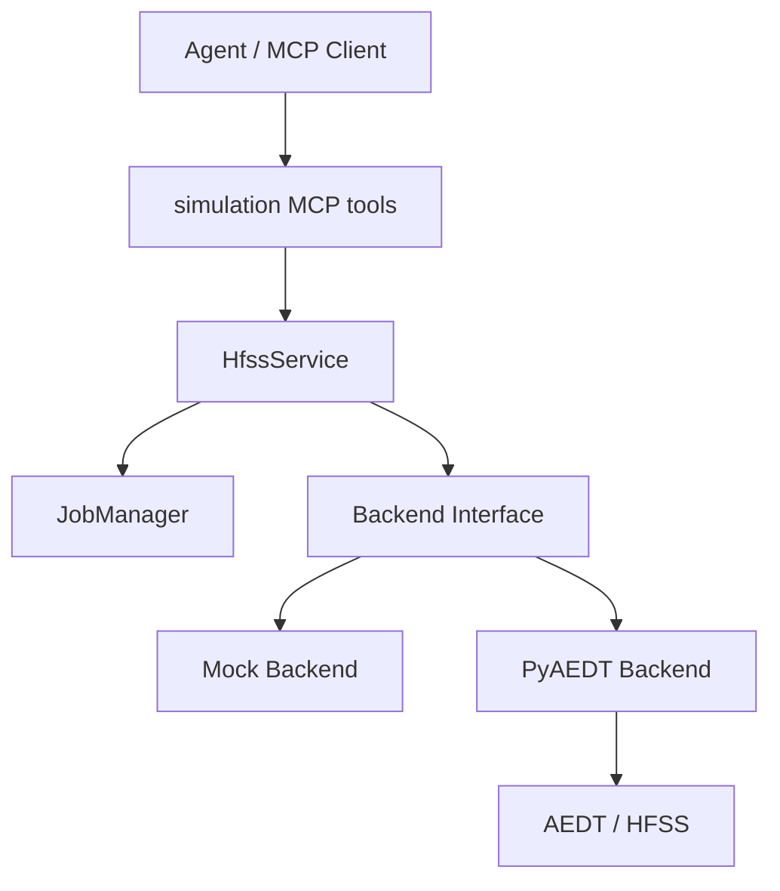
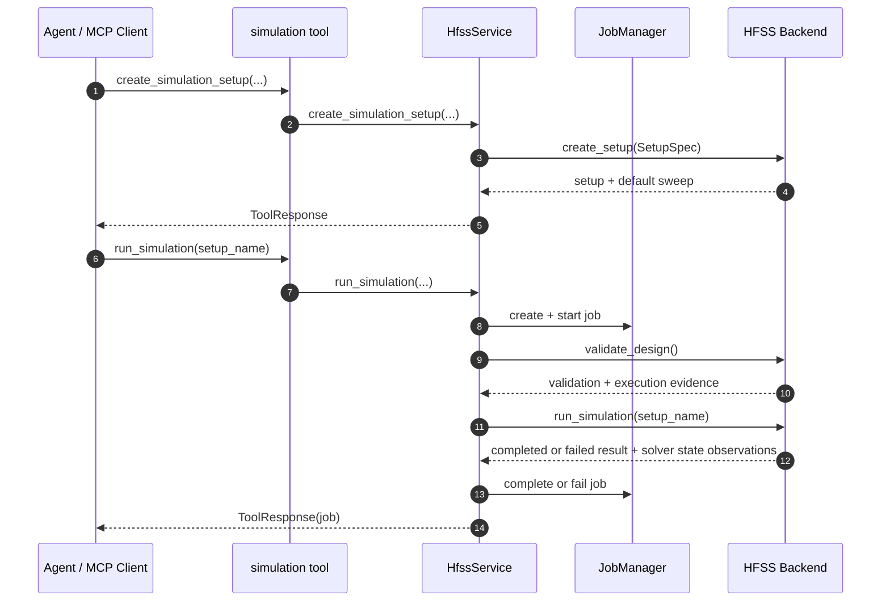

# 仿真设置与任务管理模块

## 版本信息

- 模块版本：v0.1
- 日期：2026-07-08
- 对应路线：`docs/roadmap.md` 模块 5
- 状态：已实现离线 mock 验证、MCP 工具暴露、PyAEDT 后端入口、Student 版环境适配和真实 HFSS smoke test 记录

## 模块目标

仿真设置与任务管理模块用于让 agent 在完成工程、design 和几何建模后，继续创建 HFSS setup/sweep、验证设计、启动求解，并通过 job id 查询求解状态。

该模块建立的是“可跟踪真实仿真任务”的骨架。`run_simulation` 不提供只创建 `running` job record 的假异步模式；只要 MCP client 请求仿真，服务层就必须先完成有证据的 `validate_design`，然后把求解提交到后端。真实 PyAEDT 后端提交求解后会定时读取 AEDT 仿真状态，直到 AEDT 报告不再有仿真运行，再把 job 标记为 completed 或 failed。

## 架构位置



## 2026-07-20 兼容性修正

真实 HFSS 验证发现当前 `ansys.aedt.core` 的 `Hfss.create_linear_count_sweep` 参数名为 `unit`，不是 `units`，且 `sweep_type` 只接受 `Discrete`、`Interpolating` 或 `Fast`。`src/hfss_agent_mcp/backends/pyaedt.py` 已将 `unit` 参数和内部 `LinearCount -> Discrete` 映射补齐，并新增回归测试。真实 MCP 验证应优先通过 `create_simulation_setup` 检查 setup 和 sweep 是否真正创建成功。

官方接口：[Hfss.create_linear_count_sweep](https://aedt.docs.pyansys.com/version/stable/API/_autosummary/ansys.aedt.core.hfss.Hfss.create_linear_count_sweep.html)

## 2026-07-20 重测 5 真实阻塞

真实 Student 2025 R2 HTTP MCP 验证确认 `create_simulation_setup` 和 `create_frequency_sweep` 已能创建 101 点 `LinearCount` sweep，但 `validate_design` 不能直接调用不存在的 PyAEDT 方法，真实 setup 求解也返回 `failed`。详见：

- `docs/测试问题/PyAEDT真实设计校验接口缺失.md`
- `docs/测试问题/PyAEDT真实求解失败.md`
- `docs/测试报告/模块6-真实HFSS验证-2026-07-20-重测5.md`

## 核心文件

- `src/hfss_agent_mcp/core/jobs.py`：定义 `JobRecord` 和 `JobManager`。
- `src/hfss_agent_mcp/core/simulation.py`：提供 setup/sweep 结构化转换辅助函数。
- `src/hfss_agent_mcp/core/models.py`：扩展 `SetupSpec`，新增 `SweepSpec`。
- `src/hfss_agent_mcp/core/service.py`：提供 setup、sweep、validate、run 和 job 查询业务入口。
- `src/hfss_agent_mcp/tools/simulation.py`：暴露 MCP tools。
- `src/hfss_agent_mcp/backends/mock.py`：实现离线 setup/sweep/validate/run 行为。
- `src/hfss_agent_mcp/backends/pyaedt.py`：实现 PyAEDT setup/sweep/validate/run 入口。
- `tests/test_simulation_jobs.py`：覆盖 setup/sweep、真实求解 job、validation gate、失败 job 和未知 job。
- `tests/test_pyaedt_backend.py`：覆盖 Student 版 AEDT executable 到 PyAEDT 环境变量、版本推导、真实 validation API 和求解状态轮询的适配逻辑。

## MCP Tools

### `create_simulation_setup`

创建 HFSS setup，并兼容创建一个默认 sweep。

主要参数：
- `setup_name`
- `frequency_ghz`
- `sweep_name`
- `sweep_start_ghz`
- `sweep_stop_ghz`
- `sweep_points`
- `sweep_type`
- `max_delta_s`
- `max_passes`
- `min_passes`

### `create_frequency_sweep`

为已有 setup 新增或覆盖一个频率 sweep。

主要参数：
- `setup_name`
- `sweep_name`
- `sweep_start_ghz`
- `sweep_stop_ghz`
- `sweep_points`
- `sweep_type`

### `validate_design`

真实 PyAEDT 后端通过 `Hfss.validate_full_design()` 执行 HFSS 的设计校验，并把校验消息转换为服务层统一的 `valid`、`errors`、`warnings`、`messages` 字段。返回中还会带上 `validation_backend="pyaedt"`、`api="validate_full_design"` 和 `raw_result`，作为服务层判断“确实执行过 validation”的证据。不能调用不存在的 `Hfss.validate_design()`。

验证当前 active design。返回结构化字段：
- `valid`
- `validation_backend`
- `api` 或 `checked_by`
- `errors`
- `warnings`
- `messages`
- `object_count`
- `setup_count`
- `sweep_count`

### `run_simulation`

PyAEDT 适配器对真实 HFSS 使用 `analyze_setup(name=..., blocking=False)` 直接提交指定 setup，然后定时读取 `are_there_simulations_running` 或底层 `oDesktop.AreThereSimulationsRunning()`，直到 AEDT 报告求解结束。这里不调用高层 `Hfss.analyze(setup=...)`，因为该高层方法会先执行工程保存；在 Student AEDT 的已有 gRPC 会话中，保存可能被 AEDT 拒绝并阻断求解。该适配策略保留 setup 级求解能力，同时避免把保存工程和求解动作强耦合。

启动 setup 求解，并创建 job record。服务层会在求解前再次调用 `validate_design`；如果 validation 返回 `valid=true` 但没有 `api`、`checked_by`、`validation_backend`、`raw_result` 或真实 messages 等执行证据，也会拒绝进入求解器。

参数：
- `setup_name`

返回：
- `status`
- `job`
- `simulation_status_checks`
- `observed_running`
- `solver_state_observations`
- backend 求解结果或失败原因。

### `get_simulation_job`

按 `job_id` 查询 job record。未知 job 返回结构化 `JobError`。

## 数据流



## 设计原因

HFSS 求解可能很慢，但 MCP 不能返回一个没有提交真实求解的 `running` 状态。模块 5 把 job id、状态、开始时间、结束时间、失败原因、日志摘要和后端求解状态观测变成稳定协议字段。后续如果需要真正的后台队列，应由独立 worker 提交真实 HFSS 求解并持续更新 job record，而不是在未提交求解时返回 running。

同时，setup 和 sweep 被拆成两个层次：`create_simulation_setup` 仍保留默认 sweep 以兼容旧流程；`create_frequency_sweep` 用于后续更细的扫频、重扫频和优化流程。

## 真实 HFSS 环境

当前本机真实环境：
- AEDT：Ansys Electronics Desktop Student 2025 R2
- 启动程序：`D:\Ansys\ANSYS Inc\ANSYS Student\v252\AnsysEM\ansysedtsv.exe`
- Python 控制包：`pyaedt>=1.2`，安装后提供 `ansys.aedt.core`

真实 smoke test 已执行到以下状态：

1. `pyaedt` 已安装到项目使用的 Python 运行时，`ansys.aedt.core` 可导入。
2. 真实 MCP 服务可使用 `--backend pyaedt --transport streamable-http` 启动。
3. MCP client 能通过 HTTP 调用 `connect_hfss`、`create_simulation_setup`、`validate_design`、`run_simulation`、`get_simulation_job` 等工具。
4. `env_check` 能识别 Student 版 executable，且后端会自动推导 `ANSYSEMSV_ROOT252` 与 `desktop_version="2025.2"`，避免 PyAEDT 把 Student 版误判为普通商业版。
5. `run_simulation` 已在真实 Student 2025 R2 中验证 validation gate：空 design 会在求解前被截停，并返回 HFSS 原始 validation 错误。

## 已知限制

1. 当前 job registry 是进程内内存结构，MCP server 重启后 job record 会丢失。
2. 真实 solver 失败后的 `hfss_messages` 已有后端采集逻辑和离线回归测试；仍需要继续补充更多真实 solver 失败样本，覆盖端口、网格、材料和 license 类错误。
3. `connect_hfss` 会根据 configured executable 自动推导 Student 版和桌面版本；若服务器使用不同安装路径，需要确认路径中包含类似 `v252` 的 AEDT 版本目录。
4. 如果某个 PyAEDT/AEDT 版本无法读取 `are_there_simulations_running` 或 `AreThereSimulationsRunning`，结果会返回 `status_api_available=false` 的状态观测；此时不能把它当作已观察到真实运行中的证据。

## 验证方法

运行模块 5 专项测试：

```powershell
& "C:\Users\ASUS\.cache\codex-runtimes\codex-primary-runtime\dependencies\python\python.exe" -B -m unittest tests.test_simulation_jobs -v
```

运行 PyAEDT 连接适配测试：

```powershell
& "C:\Users\ASUS\.cache\codex-runtimes\codex-primary-runtime\dependencies\python\python.exe" -B -m unittest tests.test_pyaedt_backend -v
```

运行全量离线测试：

```powershell
& "C:\Users\ASUS\.cache\codex-runtimes\codex-primary-runtime\dependencies\python\python.exe" -B -m unittest discover -s tests -v
```

确认 MCP 工具注册：

```powershell
$env:PYTHONPATH="E:\LLMproject\HFSSagent\src"
& "C:\Users\ASUS\.cache\codex-runtimes\codex-primary-runtime\dependencies\python\python.exe" -B -m hfss_agent_mcp list-tools --backend mock
```

## 2026-07-23 更新：仿真前 validation gate 与真实错误返回

`run_simulation` 当前在进入求解器前会先执行 `validate_design`。如果 HFSS validation 返回 `valid=false`，服务会直接把 job 标记为 failed，并返回 `validation` 和 `failure_reason`，不会继续调用求解器。

PyAEDT 后端在求解失败或 worker 异常时，会尽量采集 AEDT message manager / PyAEDT logger 中的真实 HFSS 消息，并通过 `hfss_messages` 返回给 agent。服务层统一异常响应会把 `details.hfss_messages` 和 `details.validation` 展开到 MCP tool response 的 `data` 中。

标准仿真流程固定为：

```text
create_*_antenna
create_simulation_setup
create_frequency_sweep
validate_design
run_simulation
get_s_parameters / analyze_s_parameters
```
