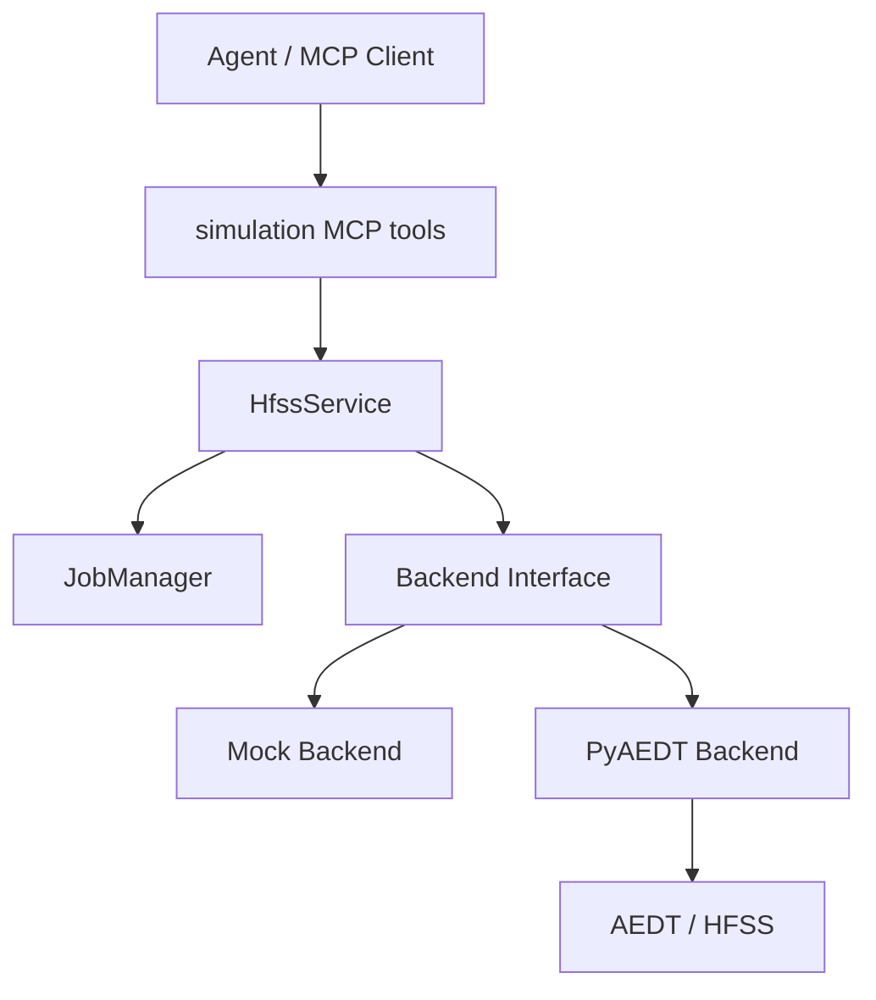
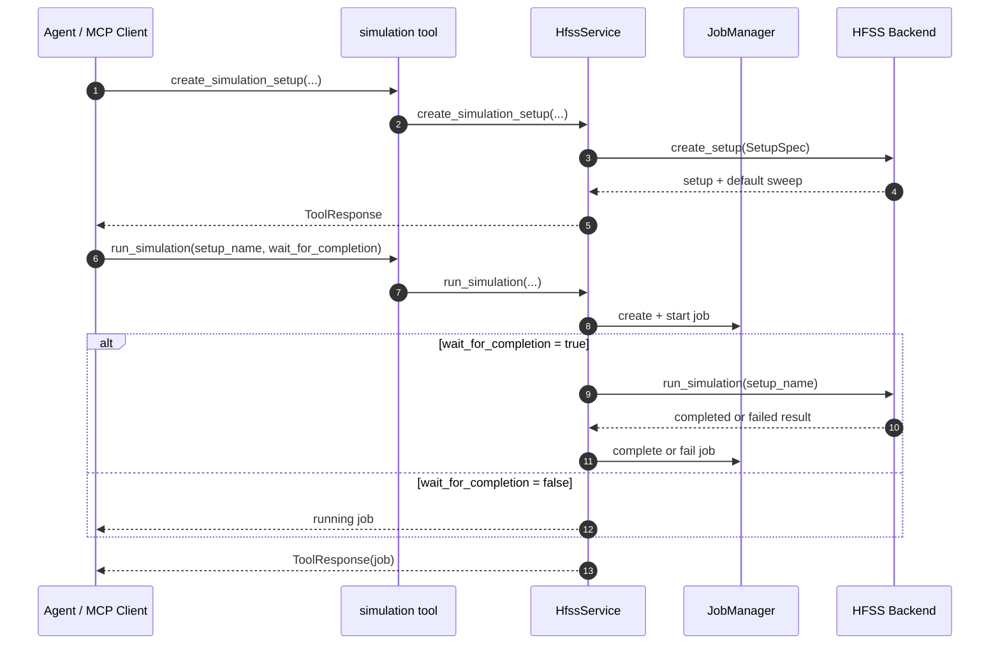

# 仿真设置与任务管理模块

## 版本信息

- 模块版本：v0.1
- 日期：2026-07-08
- 对应路线：`docs/roadmap.md` 模块 5
- 状态：已实现离线 mock 验证、MCP 工具暴露、PyAEDT 后端入口、Student 版环境适配和真实 HFSS smoke test 记录

## 模块目标

仿真设置与任务管理模块用于让 agent 在完成工程、design 和几何建模后，继续创建 HFSS setup/sweep、验证设计、启动求解，并通过 job id 查询求解状态。

该模块建立的是“可跟踪仿真任务”的骨架。同步求解路径会直接等待 backend 返回结果；异步路径当前先创建 MCP server 内部 job record 并返回 `running` 状态，后台 worker、真实非阻塞求解和日志持续采集属于后续任务队列/部署模块继续增强。

## 架构位置



## 核心文件

- `src/hfss_agent_mcp/core/jobs.py`：定义 `JobRecord` 和 `JobManager`。
- `src/hfss_agent_mcp/core/simulation.py`：提供 setup/sweep 结构化转换辅助函数。
- `src/hfss_agent_mcp/core/models.py`：扩展 `SetupSpec`，新增 `SweepSpec`。
- `src/hfss_agent_mcp/core/service.py`：提供 setup、sweep、validate、run 和 job 查询业务入口。
- `src/hfss_agent_mcp/tools/simulation.py`：暴露 MCP tools。
- `src/hfss_agent_mcp/backends/mock.py`：实现离线 setup/sweep/validate/run 行为。
- `src/hfss_agent_mcp/backends/pyaedt.py`：实现 PyAEDT setup/sweep/validate/run 入口。
- `tests/test_simulation_jobs.py`：覆盖 setup/sweep、同步 job、异步 job、失败 job 和未知 job。
- `tests/test_pyaedt_backend.py`：覆盖 Student 版 AEDT executable 到 PyAEDT 环境变量、版本推导的适配逻辑。

## MCP Tools

### `create_simulation_setup`

创建 HFSS setup，并兼容创建一个默认 sweep。

主要参数：
- `setup_name`
- `frequency_ghz`
- `sweep_name`
- `sweep_start_ghz`
- `sweep_stop_ghz`
- `sweep_points`
- `sweep_type`
- `max_delta_s`
- `max_passes`
- `min_passes`

### `create_frequency_sweep`

为已有 setup 新增或覆盖一个频率 sweep。

主要参数：
- `setup_name`
- `sweep_name`
- `sweep_start_ghz`
- `sweep_stop_ghz`
- `sweep_points`
- `sweep_type`

### `validate_design`

验证当前 active design。返回结构化字段：
- `valid`
- `errors`
- `warnings`
- `object_count`
- `setup_count`
- `sweep_count`

### `run_simulation`

启动 setup 求解，并创建 job record。

参数：
- `setup_name`
- `wait_for_completion`：`true` 时同步等待 backend 返回；`false` 时只创建可查询的运行中 job record。

返回：
- `status`
- `job`
- backend 求解结果或失败原因。

### `get_simulation_job`

按 `job_id` 查询 job record。未知 job 返回结构化 `JobError`。

## 数据流



## 设计原因

HFSS 求解可能很慢，agent 不能只拿到一个阻塞式函数调用结果。模块 5 先把 job id、状态、开始时间、结束时间、失败原因和日志摘要变成稳定协议字段，让后续真实异步队列、日志采集和多用户并发控制有统一承载结构。

同时，setup 和 sweep 被拆成两个层次：`create_simulation_setup` 仍保留默认 sweep 以兼容旧流程；`create_frequency_sweep` 用于后续更细的扫频、重扫频和优化流程。

## 真实 HFSS 环境

当前本机真实环境：
- AEDT：Ansys Electronics Desktop Student 2025 R2
- 启动程序：`D:\Ansys\ANSYS Inc\ANSYS Student\v252\AnsysEM\ansysedtsv.exe`
- Python 控制包：`pyaedt>=1.2`，安装后提供 `ansys.aedt.core`

真实 smoke test 已执行到以下状态：

1. `pyaedt` 已安装到项目使用的 Python 运行时，`ansys.aedt.core` 可导入。
2. 真实 MCP 服务可使用 `--backend pyaedt --transport streamable-http --host 127.0.0.1 --port 8015` 启动。
3. MCP client 能通过 HTTP 调用 `health_check`，并能看到 `create_simulation_setup`、`create_frequency_sweep`、`validate_design`、`run_simulation`、`get_simulation_job` 等工具。
4. `env_check` 能识别 Student 版 executable，且后端会自动推导 `ANSYSEMSV_ROOT252` 与 `desktop_version="2025.2"`，避免 PyAEDT 把 Student 版误判为普通商业版。
5. 当前阻塞点位于 PyAEDT `Hfss(...)` 初始化真实 Student 版会话：无论通过 MCP `connect_hfss` 新建会话，还是直接用 Python 连接已有 gRPC 端口，都会在 PyAEDT 初始化处长时间不返回。已确认本机存在 Student 版 AEDT 进程和 gRPC 端口，例如 `53387`，端口连通性正常。

因此，模块 5 的离线协议、工具暴露、job 管理和 PyAEDT 调用入口已经完成；真实 HFSS 完整闭环还需要在后续模块优先补齐 COM/CLI adapter，或进一步校准 Student 版 PyAEDT 会话启动方式。

## 已知限制

1. 当前异步模式只创建可查询的 `running` job record，不启动后台 worker。
2. 当前 job registry 是进程内内存结构，MCP server 重启后 job record 会丢失。
3. PyAEDT setup/sweep API 已接入；当前 Student 2025 R2 的真实会话初始化在 `Hfss(...)` 处卡住，真实完整闭环需要继续校准 PyAEDT、COM 或 CLI 路径。
4. 结果读取和工程判据分析仍属于模块 6。
5. `connect_hfss` 会根据 configured executable 自动推导 Student 版和桌面版本；若服务器使用不同安装路径，需要确认路径中包含类似 `v252` 的 AEDT 版本目录。

## 验证方法

运行模块 5 专项测试：

```powershell
& "C:\Users\ASUS\.cache\codex-runtimes\codex-primary-runtime\dependencies\python\python.exe" -B -m unittest tests.test_simulation_jobs -v
```

运行 PyAEDT 连接适配测试：

```powershell
& "C:\Users\ASUS\.cache\codex-runtimes\codex-primary-runtime\dependencies\python\python.exe" -B -m unittest tests.test_pyaedt_backend -v
```

运行全量离线测试：

```powershell
& "C:\Users\ASUS\.cache\codex-runtimes\codex-primary-runtime\dependencies\python\python.exe" -B -m unittest discover -s tests -v
```

确认 MCP 工具注册：

```powershell
$env:PYTHONPATH="E:\LLMproject\HFSSagent\src"
& "C:\Users\ASUS\.cache\codex-runtimes\codex-primary-runtime\dependencies\python\python.exe" -B -m hfss_agent_mcp list-tools --backend mock
```
