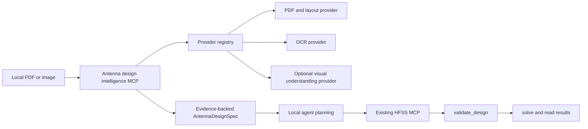

# Antenna Design Intelligence MCP Design

## Goal

Build a standalone, offline-first MCP service that turns local antenna papers and
screenshots into an evidence-backed antenna design specification.  A local agent
uses that specification together with the existing `hfss-agent-mcp` resources and
tools to plan modelling and simulation.  This service never opens, controls, or
simulates HFSS.

## Scope and boundaries

Inputs are local PDF files and local image files.  The service extracts text,
tables, figure captions, design parameters, and visible geometry cues into a
strict schema.  It reports missing information explicitly rather than inventing
dimensions or port definitions.

The service owns file validation, document/image processing orchestration,
evidence capture, schema validation, and domain-level extraction prompts.  It
does not own HFSS sessions, PyAEDT, geometry creation, simulation setup, design
validation, solver control, or result interpretation.  Those remain in
`hfss-agent-mcp`.

## Architecture

The core package must have no mandatory dependency on a specific VLM, GPU runtime,
or model file.  Providers are selected by configuration and report availability
and capability metadata.  A missing optional provider degrades extraction quality
but must not prevent the MCP server from starting.

## Provider contract

Each provider implements a narrow, typed contract and returns normalized records:

- `DocumentProvider`: local PDF to pages, reading-order text, tables, captions,
  and source locations.
- `OcrProvider`: local image or rendered page to recognized text and bounding
  boxes.
- `VisionProvider`: image plus a schema-directed request to geometry cues,
  diagram relationships, and visual labels.  This provider is optional and will
  be added after the deployment model/runtime is selected.

Provider outputs include provider identifier, version, input digest, diagnostics,
and source references.  The core layer never accepts arbitrary scripts, URLs, or
model names from an MCP client.

## Canonical output

`AntennaDesignSpec` is the sole boundary exposed to a planning agent.  It contains:

- antenna family and topology;
- target bands and performance targets;
- substrate, conductor, and dielectric information;
- named dimensions with value, unit, tolerance/status, and semantic role;
- feeding, port, boundary, and radiation-region facts when evidenced;
- geometry relationships extracted from figures;
- source evidence for every assertion: input file identity, page/image, region,
  quoted OCR/text or visual observation, confidence, and extraction provider;
- contradictions, unresolved fields, and questions that must be answered before
  HFSS modelling.

Values have one of `confirmed`, `inferred`, `conflicting`, or `unknown` status.
Only `confirmed` values may be treated as direct reproduction inputs.  Inferred
values are usable only after the local agent records an engineering assumption;
unknown values are never silently defaulted.

## MCP surface

The initial server exposes read-oriented tools only:

- `inspect_input`: validate a local file within configured allowed roots and
  return content type, digest, page/image count, and available providers.
- `extract_document_evidence`: run available document/OCR providers and persist a
  structured extraction artifact in the managed output directory.
- `extract_antenna_design_spec`: combine selected evidence into a schema-validated
  `AntennaDesignSpec`, including gaps and contradictions.
- `get_extraction_artifact`: read a managed artifact by opaque identifier.
- `list_providers`: report enabled providers, versions, capabilities, and health.

Resources act as a handbook for small models: extraction workflow, field
definitions, evidence requirements, known limitations, and the hand-off protocol
to the HFSS MCP validation gate.

## Reuse assessment

The default PDF/layout adapter will target [Docling](https://github.com/docling-project/docling),
whose code is MIT licensed and whose documentation explicitly supports local,
air-gapped execution, PDF layout/OCR/table processing, and JSON/Markdown export.
The adapter is optional so the core does not acquire its large runtime until an
offline package is assembled.

An optional OCR adapter can use [PaddleOCR](https://github.com/PaddlePaddle/PaddleOCR)
with explicitly pre-staged local model directories; its documented ONNX Runtime
engine offers a practical small-runtime option.  An optional advanced parser can
use [MinerU](https://github.com/opendatalab/MinerU), which accepts local PDF/image/
Office inputs and produces Markdown/JSON, but it must remain optional because its
current license is a custom MinerU Open Source License based on Apache 2.0 and its
deployment footprint is larger.

Future `VisionProvider` implementations may call a local OpenAI-compatible VLM
endpoint.  [llama.cpp](https://github.com/ggml-org/llama.cpp/blob/master/docs/multimodal.md)
is one candidate because it can serve local multimodal models through an
OpenAI-compatible endpoint, but its multimodal support is documented as
experimental.  The chosen model/runtime is deliberately deferred; no model files
or model-specific dependency belong in the first implementation.

## File safety and offline deployment

Inputs must be resolved beneath configured read-only input roots.  Artifacts must
be created only beneath a configured output root and referred to by opaque IDs.
The service never downloads models at runtime.  Model/runtime packages, if later
enabled, are staged on a connected build machine and released separately from Git
as an offline Windows bundle.  A light update package contains only source,
configuration templates, documentation, and manifest data; it contains no model,
cache, virtual environment, user paper, HFSS project, result, or log.

## Validation strategy

Offline automated tests cover path containment, type/size limits, provider
registration and unavailable-provider behavior, evidence/schema validation,
contradictory values, unit preservation, artifact isolation, and MCP tool
registration.  Fixtures contain synthetic papers and images only.

End-to-end acceptance uses a sample antenna paper and its figure: inspect input,
extract evidence, generate a specification with at least one unresolved field,
and have a separate local agent use only confirmed fields to call the real HFSS
MCP.  That agent must execute `validate_design` before any solve, confirm solver
entry, retain raw HFSS validation/solver diagnostics, and verify the selected
resource-release semantics.  The intelligence MCP itself is accepted without
requiring an HFSS runtime; the composed reproduction workflow is not.

## Non-goals for the first increment

- Selecting, packaging, downloading, or benchmarking a VLM.
- Reconstructing exact 3D CAD from a single figure.
- Automatically calling HFSS tools or bypassing `validate_design`.
- Treating OCR/VLM output as ground truth without provenance.
- Remote URLs, cloud inference, or arbitrary code execution.
