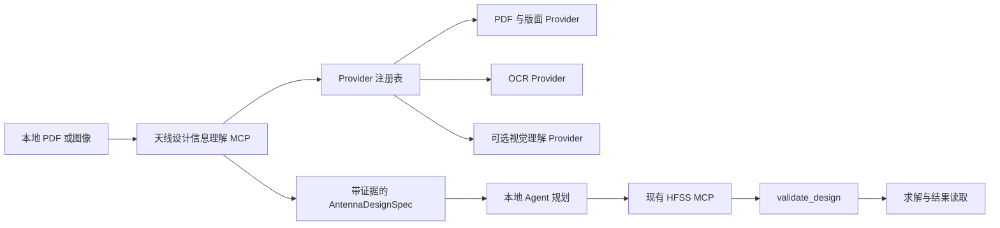

# 天线设计信息理解 MCP 设计

## 目标

构建一个独立、离线优先的 MCP 服务：将本地天线论文和截图转换为带证据链的天线设计规格。本地 agent 再结合现有 `hfss-agent-mcp` 的 resources 和 tools，自主规划建模与仿真。本服务绝不打开、控制或仿真 HFSS。

## 范围与边界

输入为本地 PDF 文件和本地图像文件。服务提取正文、表格、图注、设计参数与可见几何线索，并生成严格的结构化 schema。信息不足时必须显式报告，不能虚构尺寸或端口定义。

本服务负责文件校验、文档/图像处理编排、证据留存、schema 校验及天线领域提取提示词；不负责 HFSS session、PyAEDT、几何创建、仿真 setup、设计校验、求解器控制或结果解释。这些职责继续由 `hfss-agent-mcp` 承担。

## 架构

核心包不得强制依赖任何特定 VLM、GPU 推理框架或模型文件。Provider 由配置选择，并报告可用性与能力元数据。可选 provider 缺失时，只能降低提取质量，不能阻止 MCP 服务启动。

第一阶段不下载、不打包或内置 OCR/VLM。生产配置中的视觉类 provider 必须明确显示为“未配置”，不得把测试能力宣传为可部署的识图能力。

## Provider 合约

每个 provider 都实现窄而明确的强类型合约，并返回标准化记录：

- `DocumentProvider`：将本地 PDF 转为页面、阅读顺序文本、表格、图注和来源位置。
- `OcrProvider`：将本地图像或渲染页面转为识别文本和文本框坐标。
- `VisionProvider`：接收图像与 schema 驱动的请求，输出几何线索、图中关系与视觉标签。该 provider 是可选能力，在确定部署模型与运行时后再实现。
- `VerificationEvidenceProvider`：仅限开发/测试配置。它读取受控、人工核对的结构化证据，不进行 OCR 或视觉推理，用于验证 provider 编排、证据溯源、规格校验和向 HFSS MCP 的交接。

所有 provider 输出均包含 provider 标识、版本、输入摘要、诊断信息和来源引用。核心层绝不接受 MCP client 提交的任意脚本、URL 或模型名称。

## 标准输出

`AntennaDesignSpec` 是暴露给规划 agent 的唯一边界，包含：

- 天线类别与拓扑；
- 目标频段和性能指标；
- 基板、导体和介质信息；
- 已命名尺寸：数值、单位、状态/误差和语义角色；
- 有证据支持时的馈电、端口、边界和辐射区域事实；
- 从图中提取的几何关系；
- 每项结论的来源证据：输入文件标识、页码/图像、区域、原文/OCR 内容或视觉观察、置信度和提取 provider；
- 冲突项、未解决字段以及 HFSS 建模前必须补充的问题。

每个值都具有 `confirmed`、`inferred`、`conflicting` 或 `unknown` 状态。只有 `confirmed` 可以直接作为论文复现输入；`inferred` 只有在本地 agent 显式记录工程假设后才能使用；`unknown` 永远不能被静默填默认值。

## MCP 接口

第一阶段只提供读取和提取类 tools：

- `inspect_input`：校验配置允许根目录中的本地文件，返回内容类型、摘要、页/图数量和可用 providers。
- `extract_document_evidence`：运行可用的文档/OCR providers，并在受控输出目录中保存结构化提取产物。
- `extract_antenna_design_spec`：合并指定证据，生成经过 schema 校验的 `AntennaDesignSpec`，同时返回缺口与冲突。
- `get_extraction_artifact`：使用不透明 ID 读取受控产物。
- `list_providers`：返回启用的 providers、版本、能力和健康状态。

Resources 应作为小模型的工作手册，描述提取流程、字段定义、证据要求、已知限制，以及交接至 HFSS MCP `validate_design` 门禁的协议。

## 开源复用调研结论

默认 PDF/版面 adapter 的目标是 [Docling](https://github.com/docling-project/docling)。其代码为 MIT 许可证，文档明确支持本地隔离环境运行、PDF 版面/OCR/表格处理和 JSON/Markdown 输出。该 adapter 必须是可选依赖，直到制作离线包时才引入其较大的运行时。

可选 OCR adapter 可以使用 [PaddleOCR](https://github.com/PaddlePaddle/PaddleOCR)，并且必须配置为使用预置的本地模型目录；其已文档化的 ONNX Runtime engine 是较轻量的运行时选项。可选的高级解析 adapter 可以使用 [MinerU](https://github.com/opendatalab/MinerU)，它支持本地 PDF、图像和 Office 输入并输出 Markdown/JSON；但它必须保持可选，因为目前使用的是基于 Apache 2.0 的 MinerU 自定义开源许可证，且部署体积更大。

未来 `VisionProvider` 可以调用本地 OpenAI 兼容的 VLM endpoint。[llama.cpp](https://github.com/ggml-org/llama.cpp/blob/master/docs/multimodal.md) 是一个候选运行时，因为它可通过 OpenAI 兼容 endpoint 服务本地多模态模型；但其多模态支持仍在文档中标为 experimental。模型与运行时的选型刻意延后，第一阶段不得加入模型文件或模型专属依赖。

## 文件安全与离线部署

输入路径必须解析并限制在配置的只读输入根目录下。产物只能写入配置的输出根目录，MCP client 通过不透明 ID 引用它们。服务运行时不得下载模型。

未来启用的模型和运行时包应在联网构建机上预置，再作为独立 Windows 离线完整包发布，不能提交到 Git。轻量更新包只能包含源代码、配置模板、文档和 manifest 数据，不能包含模型、缓存、虚拟环境、用户论文、HFSS 工程、结果或日志。

项目交付时必须提供中文部署指南：说明 provider 配置方式、模型文件应放置的位置、模型摘要校验、离线安装步骤、启用/禁用 provider 的配置、健康检查命令、典型输入与回滚方式。该指南在模型选型前只给出通用 provider 部署框架；待用户选定模型后再补充对应的下载、转换和离线嵌入步骤。

## 验证策略

离线自动化测试应覆盖：路径约束、类型/大小限制、provider 注册和不可用行为、证据/schema 校验、矛盾数值、单位保留、产物隔离及 MCP tool 注册。测试 fixture 只能包含合成论文和合成图像。

端到端验收的主基准使用用户提供的外部本地论文：`E:\陈威-毕设\代码\天线拓扑优化\docs\相关论文\Machine-Learning-Assisted_Optimization_for_Antenna_Geometry_Design.pdf` 的场景三（论文 Section V.C，*Mutual Coupling Reduction Design*）。该场景为双单元 MIMO 的顶部/地板双层去耦结构设计，论文明确给出 5.725–5.825 GHz 工作带宽、`εr = 4.6`、`tanδ = 0.001`、两天线中心距 12.9 mm，以及去耦结构与贴片长度等需要图文联合理解的内容。

验收流程为：检查该外部只读输入；在当前开发环境中，使用 agent 可用的文档/图像分析工具生成候选证据，并由人工核对后以 `VerificationEvidenceProvider` 载入；生成规格时至少保留一个未解决字段；随后由独立本地 agent 仅使用 `confirmed` 字段调用真实 HFSS MCP。该 agent 必须在任何求解前运行 `validate_design`，确认 solver 实际进入，保留原始 HFSS validation/solver 诊断，并验证选定的资源释放语义。此验收证明 MCP 的编排、溯源和 HFSS 交接，不证明离线 OCR/VLM 的推理准确率。论文原文件不得复制到项目、测试 fixture、Git 历史或发布包中；项目只保存输入摘要、结构化证据引用和脱敏的验收记录。信息理解 MCP 本身的验收不要求 HFSS 运行时；组合后的论文复现工作流则必须在真实 HFSS 中验收。

## 第一阶段非目标

- 选择、打包、下载或评测 VLM；
- 在首版中交付 OCR/VLM 权重或宣称具备可部署的视觉推理能力；
- 根据单张图精确重建三维 CAD；
- 自动调用 HFSS tools 或绕过 `validate_design`；
- 将 OCR/VLM 输出视为无须溯源的事实；
- 支持远程 URL、云端推理或任意代码执行。
