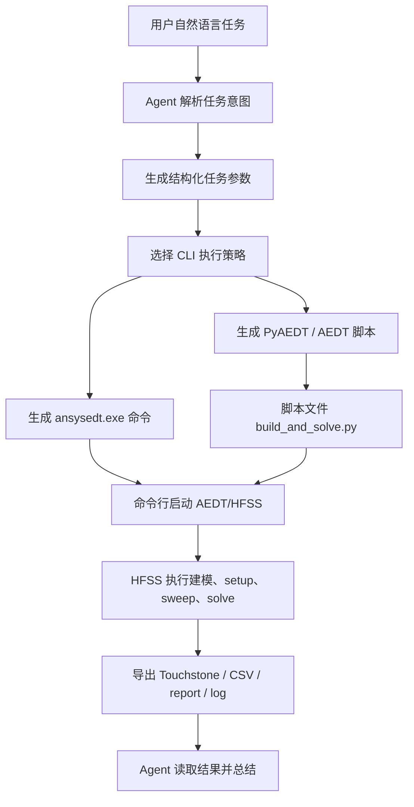
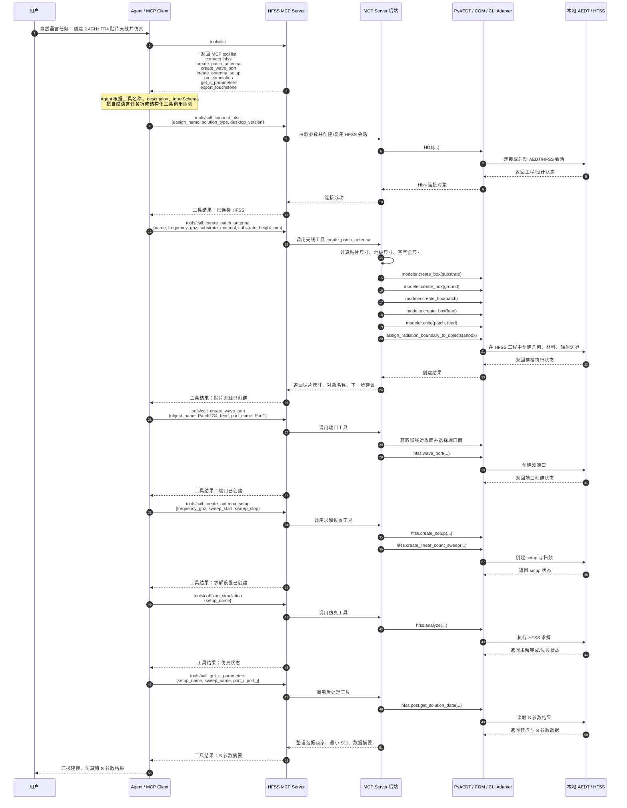
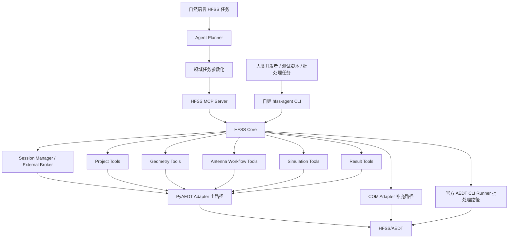

# Agent 控制 HFSS 方案调研

## 1. 项目目的

本项目目标是构建一个 可操作HFSS的agent。用户通过自然语言描述电磁仿真任务后，agent 能够理解任务意图，并辅助操作本地 Ansys Electronics Desktop / HFSS 完成建模、参数设置、端口与边界配置、仿真求解、结果导出和后续分析。

该项目面对的是典型闭源工程软件自动化问题：HFSS 本身不是为自然语言交互设计的，用户意图需要经过一层工程化翻译，才能转换为 HFSS 可执行的脚本、API 调用或命令行任务。因此，本项目的关键不是简单“调用大模型”，而是设计一套稳定、可扩展、可验证的控制链路，将自然语言任务转化为可控的 HFSS 自动化流程。

调研聚焦两类可落地路径，并补充一种工程辅助接口：

1. **CLI 方案**：通过 AEDT/HFSS 官方命令行入口执行脚本、批处理求解或数据导出。
2. **MCP 方案**：通过 Model Context Protocol 暴露结构化工具，由 agent 调用 MCP tool，再由后端使用 PyAEDT 或 COM API 控制 HFSS。
3. **自建 PyAEDT CLI 方案**：将项目内部的 HFSS 自动化能力封装成可调试、可脚本化、可测试的命令行入口，作为 MCP 的辅助接口，而不是替代 MCP 的主控层。

结论先行：官方 CLI 是 HFSS 官方提供的批处理入口，适合无交互、可重复、长时间求解任务；自建 PyAEDT CLI 适合开发调试、smoke test、批处理复现和人类手动操作；MCP 更适合作为 agent 的长期主控接口，能够把自然语言任务拆解为结构化工具调用，并在工具内部复用 PyAEDT、COM 或 CLI 能力。

## 2. agent 控制 HFSS 方法介绍：CLI、MCP 与自建 PyAEDT CLI

### 2.1 CLI 是什么，为什么需要 CLI

CLI，即 Command Line Interface，指通过命令行参数启动软件、执行脚本、运行求解或导出结果。对 HFSS/AEDT 来说，CLI 的核心价值在于：它是 Ansys 官方支持的自动化入口之一，可以在不依赖人工点击 GUI 的情况下执行确定性任务。

在本项目中，CLI 主要解决以下问题：

1. **批处理求解**：对已经建好的 `.aedt` 工程执行批量仿真，适合长时间任务和夜间任务。
2. **脚本执行**：通过命令行执行 Python/VBScript/JavaScript 脚本，让 HFSS 完成建模、设置、求解和导出。
3. **无图形界面运行**：在服务器、远程机器或自动化流水线中，减少 GUI 依赖。
4. **结果导出与工程迁移**：批量导出 Touchstone、网格统计、收敛曲线、报告数据等。
5. **与 agent 解耦**：agent 可以生成脚本和命令，由 CLI 执行；CLI 运行过程可以作为独立任务监控。

但是 CLI 的天然限制也很明显：它更像“提交任务”的接口，而不是“连续交互”的接口。每次命令通常是一次性执行，状态维护、实时纠错、复杂任务分解和交互式调参都较弱。因此，CLI 适合做任务执行器，不适合作为整个 agent 系统的唯一主控层。

### 2.2 官方 CLI 能力

Ansys 官方文档说明，Electronics Desktop 可以通过命令行启动，并支持批处理求解、批处理导出、脚本执行等能力。官方文档入口如下：

- AEDT 命令行运行说明：<https://ansyshelp.ansys.com/public/Views/Secured/Electronics/v252/en/Subsystems/HFSS/Content/GettingStarted/RunningANSYSElectronicsDesktopfromacommandline.htm>
- AEDT 脚本运行说明：<https://ansyshelp.ansys.com/public/Views/Secured/Electronics/v251/en/Subsystems/HFSS/Subsystems/HFSS%20Scripting/Content/RunningaScript.htm>

官方 CLI 能力可归纳为以下几类。

#### 2.2.1 启动 AEDT/HFSS 工程

AEDT 命令行可以打开指定工程文件，也可以结合后续命令执行批处理操作。典型形式是：

```powershell
ansysedt.exe [options] <project-file>
```

对于 HFSS agent 来说，这意味着 agent 可以将已有工程作为输入，通过命令行调用 AEDT 执行后续脚本或求解任务。

#### 2.2.2 批处理求解：BatchSolve

官方命令行支持 `BatchSolve`，用于对工程执行求解。它可以用于运行整个工程，也可以指定设计、setup 或 sweep。适用场景包括：

1. 对已有 HFSS 工程执行全部 setup。
2. 对指定设计的指定 setup 运行求解。
3. 批量运行参数扫描、Optimetrics、频率扫描等任务。
4. 在非图形界面模式下提交长时间仿真。

示例命令：

```powershell
& "C:\Program Files\AnsysEM\v252\Win64\ansysedt.exe" `
  -ng `
  -monitor `
  -BatchSolve `
  "E:\HFSSProjects\Patch2G4.aedt"
```

该命令的含义是：以非图形界面方式启动 AEDT，对 `Patch2G4.aedt` 工程执行批处理求解，并显示求解监控信息。

#### 2.2.3 脚本执行：RunScript / RunScriptAndExit

官方脚本说明中提到，AEDT 支持运行脚本文件，脚本类型包括 VBScript、Python、JavaScript 等。脚本可以在 GUI 内运行，也可以通过命令行运行。常见命令包括：

```powershell
ansysedt.exe -RunScript script.py
ansysedt.exe -RunScriptAndExit script.py
```

`RunScript` 更适合执行脚本后保留 AEDT；`RunScriptAndExit` 更适合自动化流水线，执行完成后退出 AEDT。

示例命令：

```powershell
& "C:\Program Files\AnsysEM\v252\Win64\ansysedt.exe" `
  -ng `
  -scriptargs "Patch2G4" "2.4GHz" "FR4_epoxy" `
  -RunScriptAndExit `
  "E:\HFSSagent\scripts\build_patch_and_solve.py"
```

该命令的含义是：以非图形界面运行 AEDT，把天线名称、频率和基板材料传给脚本，由脚本完成建模、求解和结果导出，脚本结束后关闭 AEDT。

#### 2.2.4 批处理数据导出：BatchExtract

官方 CLI 还支持批处理提取仿真数据，例如：

1. 收敛曲线。
2. 求解 profile。
3. 网格统计。
4. 网络参数数据。
5. 报告数据导出。
6. 特定结果文件导出。

这类能力适合在仿真结束后自动收集结果，用于 agent 汇总报告、判断仿真是否收敛、提取 S 参数或生成后续分析输入。

#### 2.2.5 gRPC 服务入口

除了一次性脚本和批处理命令外，较新的 AEDT 版本还支持以 gRPC 服务方式对外提供自动化连接入口。gRPC 服务的目的，是让 AEDT 作为一个持续运行的服务端进程，在指定端口监听来自客户端的自动化请求。外部程序不需要每次都重新启动 AEDT 或执行一次性脚本，而是可以连接到同一个 AEDT 会话，持续读取工程状态、创建或切换 design、执行建模操作、启动求解、查询求解状态和导出结果。

根据 PyAEDT 的 Client-server 文档，AEDT 2022 R2 及以后版本支持 gRPC API。远程机器上需要先启动 AEDT 并让它监听指定端口，典型命令为：

```powershell
& "C:\Program Files\AnsysEM\v222\Win64\ansysedt.exe" -grpcsrv 50051
```

Linux 环境下对应形式为：

```bash
/path/to/ANSYSEM/v222/Lin64/ansysedt -grpcsrv 50051
```

启动后，客户端可以通过机器名和端口连接到该 AEDT 会话。该模式适用于本机长会话控制、远程仿真服务器、MCP server 与 AEDT 分离部署、多轮任务复用同一 HFSS 工程等场景。

相关文档入口如下：

- PyAEDT 文档：<https://aedt.docs.pyansys.com/version/stable/>
- PyAEDT HFSS API：<https://aedt.docs.pyansys.com/version/stable/API/_autosummary/ansys.aedt.core.hfss.Hfss.html>
- PyAEDT Client-server：<https://aedt.docs.pyansys.com/version/stable/Getting_started/ClientServer.html>

PyAEDT 是访问该 gRPC 服务的常见 Python 客户端封装。也就是说，gRPC 服务本身解决的是“让外部程序持续连接 AEDT 会话”的问题，而 PyAEDT 负责把底层连接封装成 Python API，例如 `Hfss(machine="hostname", port=50051)`。

这说明 AEDT 不只有一次性脚本模式，也可以通过 Python 客户端和 AEDT 会话保持连接。不过从 agent 工程角度看，gRPC/PyAEDT 更适合作为 MCP 后端能力，而不是直接暴露给自然语言用户。

### 2.3 自建 PyAEDT CLI 方案能力

除官方 `ansysedt.exe` CLI 外，本项目还可以自建一个 `hfss-agent` CLI。这里的 CLI 不是直接替代 AEDT 官方命令行，也不是把 PyAEDT 全量 API 逐个翻译成命令，而是把项目内部已经封装好的 HFSS 工程能力暴露为可调试、可复现、可自动化测试的命令行入口。

自建 PyAEDT CLI 的核心定位是：

1. **开发调试入口**：开发者可以不经过 MCP client，直接在终端验证 session、工程、几何、端口、setup、求解和导出能力。
2. **smoke test 入口**：可以用 `hfss-agent env check --json`、`hfss-agent session start --json`、`hfss-agent design summary --json` 等命令验证本机 AEDT、license、PyAEDT 和项目路径是否可用。
3. **批处理复现入口**：对已经确定的流程，可以用 CLI 在 CI、夜间任务或人工终端中重复执行。
4. **人类可操作入口**：用户或开发者可以手动执行明确命令，快速复现 agent 的某一步操作。
5. **MCP 的同源调试面**：MCP tool 和 CLI command 调用同一个 HFSS Core，便于定位问题到底发生在 agent 规划、MCP 协议层、核心逻辑层还是 HFSS 后端。

自建 PyAEDT CLI 可以提供三种运行形态：

```text
1. one-shot command
   hfss-agent --json env check
   hfss-agent --json project open --path demo.aedt

2. REPL command
   hfss-agent
   hfss> session start --version 2024.2
   hfss> geometry box --name substrate ...

3. daemon + client command
   hfss-agentd start
   hfss-agent geometry box ...
```

其中 one-shot 命令适合环境检查、脚本化和短任务；REPL 命令适合开发期交互；daemon 形态可以让一个常驻 Python 进程长期持有 PyAEDT session，多个 CLI client 只负责发送命令。若后续 MCP server 也运行在同一个常驻进程中，则 CLI client 和 MCP tool 可以共享同一个 session manager。

自建 PyAEDT CLI 的推荐命令应面向工程任务，而不是机械映射 PyAEDT 函数。例如：

```powershell
hfss-agent --json env check
hfss-agent --json session start --version 2024.2 --non-graphical
hfss-agent --json project new --name PatchDemo
hfss-agent --json design insert --type HFSS --solution DrivenModal
hfss-agent --json antenna patch create --freq 2.4GHz --substrate FR4_epoxy --height 1.6mm
hfss-agent --json setup create --name Setup1 --freq 2.4GHz
hfss-agent --json sweep create --setup Setup1 --start 1.5GHz --stop 3.5GHz --points 401
hfss-agent --json solve run --setup Setup1
hfss-agent --json result sparam export --output results/PatchDemo.s2p
```

自建 PyAEDT CLI 的局限也很明确：

1. **工具发现弱于 MCP**：agent 需要通过 `--help`、文档或 skill 理解命令树；MCP tool 则天然提供 name、description、参数 schema 和返回结构。
2. **复杂参数表达不如 MCP 自然**：复杂边界、端口、优化目标、后处理表达式用 CLI 参数表达会变长，MCP 的 JSON schema 更清晰。
3. **权限与行为约束更粗**：CLI 可以做命令级限制，但 MCP tool 的参数级约束更适合 agent 调用。
4. **不宜作为 agent 主控层**：如果 agent 主要通过 shell 拼接 CLI 命令，会丢失 MCP 的工具发现、结构化调用和协议级状态管理优势。

因此，自建 PyAEDT CLI 的合理定位是：**HFSS Core 的开发调试、测试验证和批处理入口；MCP 才是 agent 的主交互入口。**

### 2.4 从自然语言输入 agent 到官方 CLI 控制 HFSS 的数据流向



数据流向过程解释：

1. 用户输入自然语言，例如“帮我做一个 2.4GHz FR4 贴片天线，并扫频 1.5 到 3.5GHz”。
2. agent 将自然语言解析为结构化参数，例如频率、基板材料、基板厚度、扫频范围、目标结果。
3. agent 生成一个可执行脚本，例如 `build_patch_and_solve.py`。
4. agent 调用 `ansysedt.exe -RunScriptAndExit` 或 `-BatchSolve`。
5. HFSS 按脚本或工程配置执行建模、求解和导出。
6. agent 读取导出的 S 参数、日志、收敛文件和报告文件，向用户总结结果。

官方 CLI 方案的关键特征是：agent 与 HFSS 之间通常是“脚本/命令/文件”的关系。该模式稳定、可复现，但不擅长细粒度交互。

### 2.5 MCP 是什么，为什么需要 MCP

MCP，即 Model Context Protocol，是一种用于连接 AI agent 与外部工具、数据源和本地系统的开放协议。MCP 官方说明入口如下：

- MCP 官方文档：<https://modelcontextprotocol.io/docs/getting-started/intro>
- MCP 规范仓库：<https://github.com/modelcontextprotocol/modelcontextprotocol>

在 HFSS agent 项目中，MCP 的价值在于：它可以把 HFSS 操作封装成一组结构化工具，例如：

```text
connect_hfss
create_patch_antenna
create_box
assign_wave_port
create_setup
run_simulation
get_s_parameters
export_touchstone
```

agent 不再直接生成任意脚本，而是调用经过约束、可验证、可复用的 MCP tool。每个 tool 内部再使用 PyAEDT、COM 或 CLI 与 HFSS 交互。

为什么需要 MCP：

1. **降低自然语言到 HFSS API 的跨度**：用户说“画贴片天线”，agent 可以调用 `create_patch_antenna`，而不是从零写几十行 HFSS 脚本。
2. **提高安全性**：工具参数有 schema，避免直接执行大模型生成的任意代码。
3. **提高可扩展性**：新增天线类型、端口类型、后处理能力时，只需增加工具模块。
4. **支持多轮交互**：MCP server 可以保持 HFSS 会话，agent 可以连续创建对象、检查状态、修正参数。
5. **统一多种底层接口**：同一 MCP tool 后面可以调用 PyAEDT，也可以在必要时调用 COM 或 CLI。

### 2.6 有无官方 MCP？社区资源 MCP 做到了什么能力

截至本轮调研，未发现 Ansys 官方发布的 HFSS/AEDT MCP server。当前可参考的 HFSS/AEDT MCP 方案主要来自社区或个人项目。它们的底层实现和侧重点不同，不能简单按“谁工具多”判断优劣，更应看其适合解决哪类问题。

#### 2.6.1 社区实现结构化归纳

| 项目                                | 链接                                                                       | 底层接口                                     | 主要能力                                                              | 侧重点                          |
| --------------------------------- | ------------------------------------------------------------------------ | ---------------------------------------- | ----------------------------------------------------------------- | ---------------------------- |
| Cai-aa / CAE-Agent-Hub / AEDT MCP | <https://github.com/Cai-aa/CAE-Agent-Hub/tree/main/MCP/Ansys/AEDT%20MCP> | PyAEDT + external broker + PID/port 显式绑定 | AEDT session 发现、启动、连接检查、工程信息、创建 HFSS design、启动求解、查询求解状态、WR90 波导案例 | 生命周期管理最严谨，适合做稳定底座            |
| K-13ROBOT / HFSS_MCP              | <https://github.com/K-13ROBOT/HFSS_MCP>                                  | pywin32 COM / AEDT 原生脚本 API              | 会话、几何、材料、边界、馈电、周期单元、Floquet 端口、参数扫描、优化、S11、VSWR、Zin、远场            | 不依赖 PyAEDT/gRPC，适合兼容老版本 HFSS |
| gfgf2023 / hfss-mcp-server        | <https://github.com/gfgf2023/hfss-mcp-server>                            | PyAEDT                                   | 贴片天线、偶极子、喇叭、阵列、PCB 叠层、走线、过孔、setup、sweep、后处理                       | 领域工具较丰富，适合借鉴天线/PCB workflow  |
| leonardwy / HFSS_McpServer        | <https://github.com/leonardwy/HFSS_McpServer>                            | PyAEDT/gRPC                              | 持久 HFSS 连接、基础几何、端口、边界、变量、setup、run analysis、S 参数、建模知识库            | 轻量、单文件、连接持久化经验有价值            |
| LaplaceYoung / ansys-aedt-mcp     | <https://github.com/LaplaceYoung/ansys-aedt-mcp>                         | PyAEDT + native bridge                   | 覆盖 HFSS、Maxwell、Q3D、Icepak、Circuit、HFSS 3D Layout 等大量 AEDT 工具     | 通用 AEDT 平台化能力地图，范围最广         |

#### 2.6.2 典型能力说明

**Cai-aa/CAE-Agent-Hub AEDT MCP** 的主要价值在于显式 session 管理。它要求所有 AEDT 操作必须明确指定 PID 或 gRPC port，不自动选择最近窗口。这对于工程软件非常重要，因为实际使用中用户可能同时打开多个 AEDT 实例或多个工程。该项目还采用 external PyAEDT broker，使 PyAEDT 客户端在多次 MCP 调用之间持续存在，避免每次工具调用都重建连接。

典型工具：

```text
list_aedt_sessions
launch_aedt
check_aedt_connection
create_hfss_design
start_analysis
get_analysis_status
build_wr90_waveguide
```

其中 `build_wr90_waveguide` 是一个完整示例：创建 WR90 波导，设置两个 wave port、10GHz setup、8-12GHz 扫频，并导出 Touchstone。该项目目前不是贴片天线模板库，但非常适合作为我们项目的会话管理底座。

**K-13ROBOT/HFSS_MCP** 的主要价值在于 COM/native API。它不依赖 PyAEDT，也不依赖 gRPC，因此对老版本 HFSS 更友好。对于 HFSS 2019、2020 等版本，PyAEDT/gRPC 可能不可用或能力不完整，此类 COM 方案可以作为重要补充。

**gfgf2023/hfss-mcp-server** 的主要价值在于领域封装。它提供 `create_patch_antenna` 这类高层工具，能够根据频率和材料自动计算贴片尺寸，并创建基板、地板、贴片、馈线、空气盒和辐射边界。它更接近“用户说一句话，agent 直接调用天线工具”的产品形态。

贴片天线示例流程：

```python
connect_hfss(design_name="PatchAntenna", solution_type="DrivenModal")
create_patch_antenna(
    name="Patch2G4",
    frequency_ghz=2.4,
    substrate_material="FR4_epoxy",
    substrate_height_mm=1.6,
)
create_wave_port(object_name="Patch2G4_feed", port_name="Port1")
create_antenna_setup(
    setup_name="Setup1",
    frequency_ghz=2.4,
    frequency_sweep_start_ghz=1.5,
    frequency_sweep_stop_ghz=3.5,
)
run_simulation(setup_name="Setup1")
get_s_parameters(setup_name="Setup1")
get_vswr(setup_name="Setup1")
```

**leonardwy/HFSS_McpServer** 的主要价值是轻量和持久连接。它用一个主服务文件实现了基础 MCP tool，并强调 PyAEDT 连接在多次工具调用之间不释放。它适合作为最小可用控制器参考。

**LaplaceYoung/ansys-aedt-mcp** 的主要价值是覆盖面广。它不是只针对 HFSS，而是把 AEDT 作为平台来封装，覆盖多个 Ansys Electronics Desktop 产品。对于后续从 HFSS 扩展到 Q3D、Maxwell、Icepak 等场景，该项目的能力地图值得参考。

### 2.7 从自然语言输入 agent 到 MCP 控制 HFSS 的数据流向



数据流向过程解释：

1. 用户输入自然语言任务，例如“做一个 2.4GHz FR4 贴片天线，目标 S11 小于 -10dB”。
2. agent 先解析任务意图，再选择 MCP tool，例如 `create_patch_antenna`、`create_antenna_setup`、`run_simulation`。
3. MCP server 接收结构化参数，进行参数校验和会话选择。
4. 工具内部调用 PyAEDT；若 PyAEDT 无法覆盖某些 HFSS 原生能力，则调用 COM adapter；若任务是离线批处理，则调用 CLI runner。
5. HFSS 执行建模、求解和导出。
6. MCP tool 返回结构化结果，例如对象列表、端口信息、求解状态、S 参数摘要、导出文件路径。
7. agent 根据结果继续修正参数、重新仿真或向用户汇报。

MCP 方案的关键特征是：agent 与 HFSS 之间是“结构化工具调用”的关系，而不是直接拼接脚本或命令。该模式更适合复杂多轮任务和可扩展产品化。

## 3. 官方 CLI、自建 PyAEDT CLI 和 MCP 方案对比

| 对比维度 | 官方 AEDT CLI | 自建 PyAEDT CLI | MCP 方案 |
|---|---|---|---|
| 核心定位 | AEDT 官方批处理、脚本执行和求解入口 | 项目内部 HFSS Core 的命令行外壳 | agent 工具协议与主控接口 |
| 官方支持 | AEDT 官方支持 `ansysedt.exe`、脚本、批处理求解和导出 | PyAEDT 官方支持底层 API，但 CLI 外壳需项目自建 | 未发现 HFSS/AEDT 官方 MCP server，协议本身为开放标准 |
| 底层能力 | `RunScript`、`RunScriptAndExit`、`BatchSolve`、`BatchExtract`、`-grpcsrv` | PyAEDT、项目 workflow、可选 COM/官方 CLI runner | PyAEDT、COM、自建 CLI、官方 CLI 均可作为后端 |
| 交互方式 | 一次性命令或脚本执行为主 | one-shot、REPL、daemon + client 均可设计 | 多轮结构化 tool call，可由 server 长期保持会话 |
| 会话保持 | 弱；原生命令行本身不是持续 RPC 通道，gRPC 服务需客户端连接 | 可通过 REPL 或 daemon 持有 PyAEDT session | 强；MCP server/session broker 适合长期持有 PyAEDT 或 native session |
| 工具发现 | 弱；依赖官方文档、脚本约定和命令行参数 | 中等；依赖 `--help`、README、skill、命令树 | 强；tool name、description、参数 schema、返回结构天然暴露给 agent |
| 自然语言适配 | 需要 agent 生成脚本、命令或任务文件 | 可封装工程任务命令，但 agent 仍需理解 CLI 命令树 | 工具 schema 可直接承接自然语言解析结果 |
| 参数表达 | 适合文件路径、setup 名称、脚本参数等简单输入 | 中等；复杂对象会导致命令参数过长，需要 JSON 参数文件辅助 | 强；复杂端口、边界、优化目标、后处理表达式可用结构化 schema 表达 |
| 安全性 | 若直接执行大模型生成脚本，风险较高 | 可限制命令集合，但 shell 参数和文件输入仍需额外校验 | 工具参数受限，行为边界更清晰，适合做权限和路径限制 |
| 可扩展性 | 新任务通常新增脚本或命令模板 | 新任务新增 CLI command，并复用 HFSS Core | 新任务新增 MCP tool 或 workflow，并复用 HFSS Core |
| 调试体验 | 依赖日志、退出码、导出文件 | 强；可直接终端运行、输出 JSON、做 smoke test | 中等；需要 MCP client/inspector，但可逐步检查状态 |
| 测试体验 | 适合真实 AEDT 批处理 smoke test | 适合单元测试、子进程测试、环境检查和真实后端 smoke test | 适合 tool-level mock 测试和 MCP inspector 测试 |
| 适合场景 | 已有工程批量求解、夜间任务、CI、结果导出、一次性脚本 | 开发调试、人工复现、自动化测试、批处理包装、MCP 故障诊断 | 建模、交互式调参、多轮仿真、agent 主控、自然语言控制 |
| 主要局限 | 不适合连续细粒度控制，状态管理弱 | agent 发现能力弱于 MCP，不宜作为主控协议 | 需要自建 server、工具抽象和 schema，前期工程量更高 |

综合判断：

1. 官方 AEDT CLI 是必要能力，但不宜作为主架构。它适合作为批处理、长任务、脚本执行、结果导出和兜底执行器。
2. 自建 PyAEDT CLI 有意义，但定位应是 HFSS Core 的调试、测试、复现和批处理入口，不应替代 MCP 成为 agent 主控接口。
3. MCP 更适合作为 HFSS agent 的主交互层，因为它能把自然语言任务转化为一组带 description、schema 和返回结构的受控工具调用。
4. PyAEDT 应作为首选后端，因为它是 Ansys 官方 Python 自动化库，覆盖 HFSS 建模、setup、求解和后处理等核心流程。
5. COM 脚本能力应作为 PyAEDT 封装缺失时的补充，尤其用于兼容老版本 HFSS 或调用某些 PyAEDT 尚未封装的 AEDT 原生功能。

## 4. 后续项目的设计路线

针对本项目目标，建议采用如下技术路线：

```text
放弃无状态官方 CLI 作为主控层
采用 MCP 作为 agent 与 HFSS 之间的结构化工具层
建设共享 HFSS Core，统一承接 MCP tool 和自建 CLI command
自建 PyAEDT CLI 作为开发调试、测试验证和批处理辅助入口
以 PyAEDT 作为主后端
以 COM 原生脚本 API 作为能力补充
以官方 AEDT CLI 作为批处理、长任务、脚本执行和兜底方案
```

推荐架构如下：



### 4.1 核心设计原则

1. **对闭源软件，不直接依赖 GUI 点击自动化**  
   GUI 自动化可用于极少数无法通过 API 操作的场景，但不应作为主路径。主路径应优先使用官方脚本/API/CLI 能力。

2. **放弃无状态官方 CLI 作为主控层**  
   `ansysedt.exe -RunScriptAndExit`、`BatchSolve` 等官方 CLI 入口适合提交任务，但不适合承担 agent 的持续多轮主控。HFSS agent 需要在多轮任务中保持工程状态，因此主控层应使用 MCP + session manager。

3. **MCP 填补自然语言到 PyAEDT 的差距**  
   PyAEDT 是强大的工程 API，但它不是自然语言接口。MCP tool 可以把常见 HFSS 操作封装成领域工具，例如 `create_patch_antenna`、`assign_wave_port`、`run_simulation`，让 agent 以稳定方式调用。

4. **自建 PyAEDT CLI 作为辅助接口，而不是主控协议**  
   自建 CLI 可以调用同一个 HFSS Core，提供 `--json`、REPL 或 daemon client，用于本地调试、测试、批处理和人工复现。但 agent 主路径仍应优先调用 MCP tool，因为 MCP 的 description、schema 和结构化返回更利于工具发现和安全约束。

5. **COM 脚本作为 PyAEDT 封装缺失的补充**  
   对于 PyAEDT 不覆盖、版本兼容性差或需要调用 AEDT 原生模块的功能，应保留 COM/native adapter。这一点可借鉴 K-13ROBOT/HFSS_MCP。

6. **官方 AEDT CLI 作为批处理和兜底执行器**  
   对于长时间求解、无界面服务器运行、结果批量导出、脚本一次性执行等任务，官方 AEDT CLI 仍然非常重要。它应作为 HFSS Core 内部的 `CLI Runner`，供 MCP tool 或自建 CLI command 间接调用。

### 4.2 建议分阶段落地

第一阶段：建立稳定控制底座。

1. 实现 AEDT session 发现、启动、连接检查和释放。
2. 借鉴 Cai-aa/CAE-Agent-Hub 的显式 PID/port 选择策略，避免误连错误 AEDT 实例。
3. 建立 PyAEDT adapter，跑通创建 HFSS design、保存工程、读取工程状态。
4. 建立最小自建 CLI，例如 `hfss-agent env check --json`、`hfss-agent session info --json`，用于环境诊断和后续 smoke test。

第二阶段：实现贴片天线最小闭环。

1. 实现 `create_patch_antenna`。
2. 实现 `create_wave_port` 或 `create_lumped_port`。
3. 实现 `create_setup_and_sweep`。
4. 实现 `validate_design`。
5. 实现 `run_simulation`。
6. 实现 `get_s11`、`get_vswr`、`export_touchstone`。

第三阶段：增强工程可靠性。

1. 增加日志与错误分类。
2. 增加对象列表、端口检查、边界检查。
3. 增加仿真状态轮询和超时处理。
4. 增加 COM adapter 补充能力。
5. 增加 CLI runner 用于长任务和离线脚本执行。

第四阶段：扩展领域能力。

1. 扩展偶极子、喇叭、阵列、Vivaldi、螺旋天线等模板。
2. 扩展 PCB/走线/过孔/差分对仿真。
3. 支持参数扫描、优化、目标函数闭环，例如自动调整贴片尺寸使 S11 满足目标。
4. 支持报告生成，将仿真结果、关键图表、Touchstone 文件路径和设计参数整理为可交付文档。

## 参考资料

1. Ansys AEDT 命令行运行说明：<https://ansyshelp.ansys.com/public/Views/Secured/Electronics/v252/en/Subsystems/HFSS/Content/GettingStarted/RunningANSYSElectronicsDesktopfromacommandline.htm>
2. Ansys AEDT 脚本运行说明：<https://ansyshelp.ansys.com/public/Views/Secured/Electronics/v251/en/Subsystems/HFSS/Subsystems/HFSS%20Scripting/Content/RunningaScript.htm>
3. PyAEDT 官方文档：<https://aedt.docs.pyansys.com/version/stable/>
4. PyAEDT HFSS API：<https://aedt.docs.pyansys.com/version/stable/API/_autosummary/ansys.aedt.core.hfss.Hfss.html>
5. PyAEDT Client-server 文档：<https://aedt.docs.pyansys.com/version/stable/Getting_started/ClientServer.html>
6. MCP 官方文档：<https://modelcontextprotocol.io/docs/getting-started/intro>
7. MCP 规范仓库：<https://github.com/modelcontextprotocol/modelcontextprotocol>
8. Cai-aa/CAE-Agent-Hub AEDT MCP：<https://github.com/Cai-aa/CAE-Agent-Hub/tree/main/MCP/Ansys/AEDT%20MCP>
9. K-13ROBOT/HFSS_MCP：<https://github.com/K-13ROBOT/HFSS_MCP>
10. gfgf2023/hfss-mcp-server：<https://github.com/gfgf2023/hfss-mcp-server>
11. leonardwy/HFSS_McpServer：<https://github.com/leonardwy/HFSS_McpServer>
12. LaplaceYoung/ansys-aedt-mcp：<https://github.com/LaplaceYoung/ansys-aedt-mcp>
